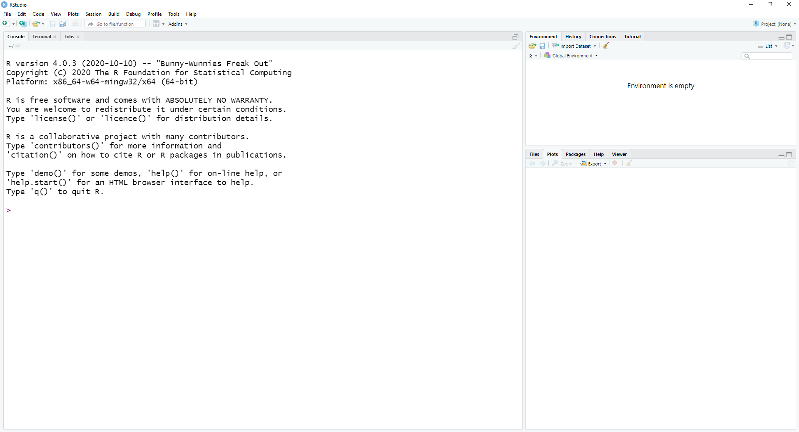
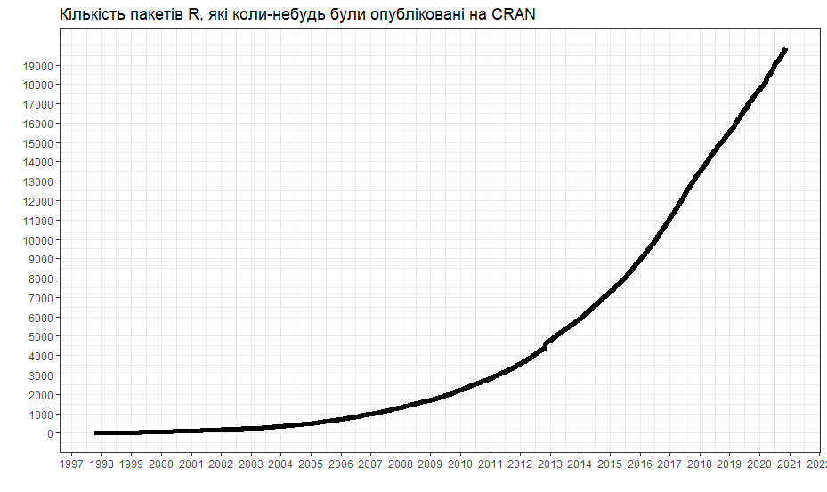

--- 
title: "<span style='font-size: 14px'>ОСНОВИ ЕКОНОМЕТРИКИ В R</style>"
author: "Ігор Мірошниченко"
date: "`r Sys.Date()`"
documentclass: book
bibliography: book.bib
biblio-style: apalike
link-citations: yes
description: "Підручик з основ економетрики з використанням мови програмування R"
---
# Основи економетрики в R {.unnumbered}

## Передмова {.unnumbered}

> Наразі підручник в процесі розробки.

> Якщо ви помітили неточності або помилки, будь-ласка напишіть мені: `ihor.miroshnychenko@kneu.ua`

<!--chapter:end:index.Rmd-->

# Вступ до R {#introR}
***
```{r setup-01, echo = FALSE, purl = FALSE, cache = FALSE, include=FALSE}
knitr::opts_knit$set(global.par = TRUE)
knitr::opts_chunk$set(warning = FALSE, message = FALSE, collapse = TRUE, out.width = '100%', cache = TRUE)
```

Мова програмування **R** --- потужний інструмент, що широко використовується в різних сферах: статистика, візуалізація, наука про дані, машинне навчання, глибоке навчання тощо. Це безкоштовна система з відкритим кодом, з широкими можливостями, які досягаються за рахунок різноманіття покетів (*packages*) доповнень.
**R** повністю безкоштовний та доступний для встановлення на більшість операційних систем. Крім того, є можливість працювати у хмарних додатках.
В той же час, **R** ідеально підходить для проведення економетричних досліджень.
Вивчити **R** не складно і цей розділ підготовить Вас до базових операцій.

## Встановлення R {#installR}
***
Варіантів роботи з мовою програмування **R** існує досить багато. Розберемо основні.

### Встановлення на комп'ютер {#instalpc}
Для початку необхідно встановити саму мову програмування під свою операційну систему:

- [Windows](https://cran.r-project.org/bin/windows/base/)
- [MacOS](https://cran.r-project.org/bin/macosx/)
- [Linux](https://cran.rstudio.com/bin/linux/)

Для роботи в **R**, також слів встановити інтегроване середовище розробки (IDE) **RStudio**, що значно підвищує зручність, швидкість та ефективність роботи.

Щоб встановити **RStudio**, завантажте останню версію інсталятора для Вашої операційної системи з сайту [https://rstudio.com/products/rstudio/download/](https://rstudio.com/products/rstudio/download/)

### Використання хмарних сервісів {#installcloud}
У випадках, коли не має можливості або бажання щось додатково встановлювати на ПК є декілька хмарних сервісів:

- [RStudio Cloud](https://rstudio.cloud/)
- [Google Colab](https://colab.research.google.com/#create=true&language=r)

## RStudio {#rsudio}
***
Я пропоную використовувати саме **RStudio**, оскільки це найзручніший інструмент для роботи з даними.
При чому в ній можна працювати з різними мовами програмування, в тому числі й **Python**.

Якщо ваша операційна система --- Windows, то після встановлення R та RStudio, на робочому столі у вас буде дві іконки:

<div style="text-align:center"> та </div>

Перша відноситься до самої мови програмування і не буде використовуватись в роботі, друга відноситься до RStudio і саме вона нам потрібна.

Після першого запуску RStudio ви побачите інтерфейс на рисунку \@ref(fig:001)
```{r 001, out.width = "100%", fig.align='center', echo = FALSE, fig.cap = "Базовий інтерфейс RStudio"}

```

Як правило код пишуть у скрипті (такий собі аналог текстового редактора), тож для його створення необхідно натиснути зелений хрестик в лівому верхньому куті та обрати пункт **R Script** або натиснути комбінацію клавіш **Ctrl+Shift+N**:

```{r 002, out.width = "75%", fig.align='center', echo = FALSE, fig.cap = "Створення скрипта в RStudio"}
knitr::include_graphics("docs/images/rstudio_02.png")
```

Після чого, з’явиться додаткове вікно скрипту, де можна писати код, зберігати його та повертатися до нього за потреби.

Давайте розберемо отриманий інтерфейс:
```{r 003, out.width = "100%", fig.align='center', echo = FALSE, fig.cap = "Інтерфейс RStudio"}

```

**1. СКРИПТ** --- відбувається основна робота з кодом.

**2. КОНСОЛЬ** --- повертаються результати виконання скриптів. Хоча тут так само писати код, проте він не буде збережений.

**3. РОБОЧИЙ ПРОСТІР** --- тут зберігаються змінні, завантажені датасети та побудовані моделі. Крім того є окреме вкладинка історії останніх команд.

**4. ГРАФІКИ та ФАЙЛИ** --- тут в окремих закладинках відображаються графіки, є невеличкий файловий менеджер, менеджер пакетів (про них трошки пізніше) та довідка по функціям (сюди будемо звертатися досить часто).

## Базові операції {#rbase}
***
R - мова програмування з широкими можливостями. З її допомогою можна будувати математичні моделі, проводити статистичні тести, візуалізовувати дані тощо. Але почнемо з чогось максимально простого, наприклад, арифметики.

### R та арифметика {#rarith}
Вже з "коробки", без додаткових пакетів, R надає можливість проводити арифметичні розрахунки. Всі ці операції виконуються за допомогою типових операторів, до яких ми звикли ще з часів навчання в школі або викорситання Excel.

Так, додавання додавання двох чисел використовується оператор `+`:
```{r 004}
2 + 2
```

Для віднімання --- оператор `-`:
```{r 005}
5 - 2
```

Множення через оператор `*`:
```{r 006}
3 * 5
```

Ділення --- `/`:
```{r 007}
25 / 5
```

Піднесення до степеню через `^`:
```{r 008}
3 ^ 3 
```

Як бачимо, нічого складного. Давайте розглянемо, ще два оператори.

Залишок від ділення --- `%%`:
```{r 009}
5 %% 3
```

Цілочисельне ділення --- `%/%`:
```{r 010, collapse=TRUE}
17 %/% 5
```

Узагальнений перелік арифметичних операторів я помістив у наступну таблицю.

| Оператор | Опис                 | Пиклад  |
|:--------:|----------------------|---------|
|     +    | Додавання            | a + b   |
|     -    | Віднімання           | a - b   |
|     *    | Множення             | a * b   |
|     /    | Ділення              | a / b   |
|     ^    | Степінь              | a ^ b   |
|    %%    | Залишок від ділення  | a %% b  |
|    %/%   | Цілочисельне ділення | a %/% b |

### Коментарі до коду {#rcomment}
Важливою складовою написання коду, окрім його зрозумілості та лаконічності, є коментарі, які допомагають оріентуватися, що відбувається в даному шматку коду.

Для додавання коментарів використовується знак ришітки або, як його ще називають, діез --- `#`. Все, що написано у рядку після `#` ігнорується R:
```{r 011}
# look at this awesome code
2 + 2 - 3 + 1
```

Якщо необхідно "закоментувати" частину коду, тобто поставити `#` на початку кожного рядка, то для цього є комбінація клавіш **Ctrl + Shift + C**.

### Пріоритети розрахунків {#rprior}
Після знайомства з арифметикою в R постає логічне питання з приводу пріоритетів операторів. На справді тут все просто, пріоритети працюють як в математиці. Тож не забувайте правильно розставляти дужки.

```{r 012}
2 + 3 * 4

(2 + 3) * 4
```

### Готові функції {#rfun}
Крім звичайних арифметичних операторів в мові програмування R одразу вбудовано багато різноманітних функцій, в тому числі й математичних.

Для розрахунку кореня квадратного з числа використовується функція `sqrt()`, яка може бути вам знайома, якщо ви користувалися англомовною версією Excel.
```{r 013}
9^0.5

9^(1/2)

sqrt(9)
```

> ***Мова програмування R чутлива до регістру***, тож варіанти Sqrt(9), SQRT(9) працювати не будуть.

Разом з тим, в середині функції можна проводити математичні розрахунки:
```{r 014}
sqrt((2 + 3) * 4)
```

Функція `abs()` розраховує абсолютне значення:
```{r 015}
abs(3 - 5)
```

Розрахунок натурального логарифму через функцію `log()`:
```{r 016}
log(15)
```

Але це ще не все, оскільки для логарифму притаманно мати основу, то в таких випадках слід додати в середині дужок додатковий аргумент `base = `:
```{r 017}
log(x = 10, base = 3)
```

Аргументи функцій можна змінювати місцями:
```{r 018}
log(base = 3, x = 10)
```

Доречі не обов'язково писати назви аргументів функцій. Якщо ви впевнені в їх порядку запис може виглядати наступним чином:
```{r 019}
log(10, 3)
```

Взагалі використання функцій --- важлива особливість мови програмування R. Ми можемо створювати власні функції, використовувати функції як аргументи інших функцій тощо.

### Вбудована документація {#rhelp}
Вже на цьому етапі може виникнути ряд питань:

- де знайти опис функції?
- які існують аргументи функцій?
- чи є якісь приклади використання функцій?

Відповідь досить проста --- всі функції супроводжуються детальною документацією. Для її виклику можна скористуватися функцією `help()`, де в середині дужок вказати назву функції:
```{r 020, eval=FALSE}
help(abs)
```

Інший варіант --- це написати в консолі знак питання і після цього назву функції:
```{r 021, eval=FALSE}
?abs()
```

Але на мою думку, **найшвидший варіант** --- це написати функцію і **натиснути клавішу F1** на клавіатурі. 

Всі зазначені варіанти приведуть вас до вікна документації у правому нижньому куті RStudio:

<div style="text-align:center"></div>

### Створення змінних {#rvar}
Ще один важливий пункт у багатьох мовах програмування --- можливість зберігати значення у змінних.

В R це робиться за допомогою символів **<-**. Для швидкого написання існує зручна комбінація клавіш `Alt + -`.

Ліворуч від символу **<-** записується назва майбутньої змінної. Праворуч --- значення або вираз, яке необхідно зберегти в цю змінну.

```{r 022}
x <- 2
y <- 4
z <- sqrt(x^2 + y^3)
```

> Для присоювання можна використовувати і знак **=** але серед спільноти користувачів R це не прийнято.

Слід звернути увагу, що при присвоюванні результат розрахунку не виводиться в консоль. Якщо ж хочеться переглянути результат слід використати функцію `print()` або просто звернутися до створеної змінної:
```{r 023}
print(z)

z
```

Після створення змінна з'являється у вкладинці **Environment** робочого простору RStudio:
<div style="text-align:center"></div>


### Оператори порівняння {#rcompar}
В процесі роботи з даними, досить часто працюємо з задачами порівняння. Для вирішення таких питань в мові програмування R є зручні та зрозумілі оператори:

| Оператор порівняння | Опис                | Приклад |
|:-------------------:|---------------------|---------|
|          ==         | Дорівнює            | a == b  |
|          !=         | Не дорівнює         | a != b  |
|          >          | Більше              | a > b   |
|          <          | Менше               | a < b   |
|          >=         | Більше або дорівнює | a >= b  |
|          <=         | Менше або дорівнює  | a <= b  |

> Окремо зауважу, що для порівняння двох змінних використовується оператор з подвійним знаком дорівнює `==`, а не з одним `=`. Це досить популярна помилка.

## Типи даних {#rdatatype}
***
Інформація зберігається в різних структурах даних. Це може бути число, текст, булева змінна тощо.

Один з найпопулярніших варіантів збереження даних --- це **числовий формат**. В мові програмування R для нього є окремий клас --- **numeric**. При цьому існує три типи numeric:

1. Цілі - **integer**.
2. Дробові - **double**.
3. Комплексні - **complex**.

В більшості випадків R буде сам конвертувати числа в потрібний формат. Але якщо необхідно задати конкретний тип числа, то можна використати функції `as.integer()`, `as.double()` та `as.complex()`.

> В мові програмування R досить багато функцій, які починаються на `as.`, які переводять об'єкт до конкретного класу. Іншими словами просить читати дані в середені дужок у відповідному форматі.

Для створення цілочислового значення можна в кінці поставити символ `L`, щоб примусово оголосити число як integer:
```{r 024}
is.integer(10)

is.integer(10L)
```

> Функції, що починаються на `is.` перевіряють, чи належить об'єкт до обраного класу.

Для роботи з **текстовими даними** є клас **character**. Вони записуються в лапках, при цьому можна використовувати як подвійні `"` так і одинарні `'`.
```{r 025}
is.character("Ash nazg durbatulûk, ash nazg gimbatul,
             ash nazg thrakatulûk, agh burzum-ishi krimpatul.")
```

3. **Логічні (logical) данні** - це тип даних які приймають лише значення `TRUE` або `FALSE`. Ми з ними вже зустрічалися коли використовували оператори порівняння.

Для перевірки типу даних використовується функція `class()`:
```{r 026}
class(5)
```

## Структури даних {#r_str}
R працює з багатьма структурами даних: вектори, матриці, масиви, дата фрейми та списки. Вони відрізняються за способом створення, структурою, складністю будови та способом звернення до їх елементів. Схематично ці структури даних зображено на рисунку \@ref(fig:027)
```{r 027, out.width = "100%", fig.align='center', echo = FALSE, fig.cap = "Структури даних R"}
knitr::include_graphics("docs/images/001_data_stucture.png")
```

### Вектор {#r_vec}
Почнемо з найпростішого. **Вектор** - це одновимірна послідовність елементів **одного типу**. Для створення вектору використовується функція `c()`.
```{r 028}
c(2, 4, 8, -2, -6, 0)

c("два", "чотири", "шість")

c(TRUE, TRUE, FALSE)
```

Для створення послідовностей з кроком 1 зручно використовувати оператор `:`
```{r 029}
-5:5

3:-2
```

Для складніших послідовностей є вбудована функція `seq()` (не забувайте дивитися довідку по функціях)
```{r 030}
seq(1, 10, by = 2)
```

Крім того, можна задати не лише крок послідовності (аргумент `by =`), а й довжину (аргумент `length.out =`)
```{r 031}
seq(1, 10, length.out = 3)
```

Інша корисна функція `rep()` дозволяє створити вектор з повторюваними значеннями. Перший аргумент - значення яке слід повторювати, другий аргумент - скільки разів повторювати.
```{r 032}
rep(3, 5)
```

При цьому і перший і другий аргумент може бути вектором:
```{r 033}
rep(1:3, 5)

rep(1:3, 1:3)
```

Крім того, можна об'єднувати вектори:
```{r 034}
v1 <- c("Say", "friend")

v2 <- c("and", "enter")

c(v1, v2)
```

В означенні вектора в мові програмування R сказано, що **всі елементи вектори мають бути одного типу**. Одразу хочеться перевірити, що буде, якщо ця умова не буде виконуватись. В більшості мов програмування ми б отримали помилку. Мова програмування R, при розбіжності типів, буде зводити все до "спільного знаменника", тобто конвертувати дані за певними правилами - приведення типів (coercion).

Виділяють два типи:

- **неявне приведення типів (implicit coercion)**, коли все відбувається автоматично за вбудованими правилами.
- **явне приведення типів (explicit coercion)**, коли ми самі вирішуємо до якого типу перевести дані, якщо це можливо.

Приклад неявного приведення типів:
```{r 035}
c(TRUE, 2, FALSE)

3 - TRUE
```
`TRUE` перетворився в `1`, а `FALSE` в `0`.
В цьому випадку всі дані приведено до текстового типу:
```{r 036}
c(TRUE, 2, "Hello")
```
В R є своя ієрархія типів:
`NULL < raw < logical < integer < double < complex < character < list < expression`

Для явного приведення типів даних використовується сімейство функцій, що починається на `as.`:
```{r 037}
as.numeric(c(TRUE, 2, FALSE, FALSE))

as.character(c(TRUE, 2, FALSE, FALSE))
```

#### Операції з векторами {#r_vec_oper}
Всі арифметичні операції, що ми розглядали раніше, можна використовувати й **до векторів однакової довжини**:
```{r 038}
q <- 1:5

w <- 2:6

q + w

q - w

q * w

q / w

w ^ q + q - w * q

sqrt(q)
```

#### Правило переписування {#r_rec_rule}
Якщо **вектори не однакової довжини** й ми хочемо провести з ними певні операції, то в такому випадку спрацює **правило переписування (recycling rule)**: якщо коротший вектор кратний довжині довшого, короткий буде повторюватися необхідну кількість разів.
```{r 039}
q <- 1:2
w <- 1:4
q * w
```

Операції з вектором та окремим значенням можна вважати окремим випадком рестайлінгу: окреме значення буде повторюватися необхідну кількість разів:
```{r 040}
w * 2
```

Якщо коротший вектор не кратний довшому (наприклад, перший довжиною 2, а інший  - 3), то R все одно порахує результат, але видасть попередження:
```{r 041, warning = TRUE}
q + c(1, 5, 7)
```

#### Індексація векторів {#r_vec_idx}
Індексація - задача вибору окремого елемента структури даних. Для цього використовуються квадратні дужки `[]`.

Найпростіший варіант індексація по номеру, тобто порядкове значення елемента:
```{r 042}
e <- c(-5:-3, 2, 7, -6, 4:2)
e[1]

e[5]
```

>**Важливий факт - індексація в мові програмування R починається з 1.**

За допомогою індексації можна не лише звертатися до окремого елементу, а й заміняти його значення:
```{r 043}
e[5] <- 15
```

Можна використовувати цілі вектори для індексації:
```{r 044}
e[2:5]

e[6:1]
```

Індексація зі знаком мінус видасть всі значення вектора крім обраних:
```{r 045}
e[-1]

e[c(-1, -5)]
```

### Матриці {#r_matrix}
**Матриця (matrix)** --- це двовимірний масив даних, в якому кожен елемент має однаковий тип (числовий, текстовий, логічний). Іншими словами, матриця - це двовимірний вектор, у якого є довжина та ширина.

Створення матриці відбувається за допомогою функції `matrix()`, в якій слід вказати кількість рядків та стовпчиків:

```{r 046}
matrix(1:16, nrow = 4, ncol = 4)
```

За замовчуванням значення матриці заповнюються по стовпчиках. Але це можна змінити за допомогою аргументу `byrow = TRUE`
```{r 047}
matrix(1:16, nrow = 4, ncol = 4, byrow = TRUE)
```

Оскільки матриця --- це двовимірний масив, то для індексації використовуються два індекси, що розділені комою: перший відповідає за рядок, другий за стовпчик.
```{r 048}
my_matrix <- matrix(1:16, nrow = 4, ncol = 4)
my_matrix

my_matrix[2, 3]

my_matrix[1:2, 3:4]
```

Якщо один з індексів залишити пустим --- отримаємо всі значення рядка/стовпчика в залежності від того, який індекс ми не вказуємо.
```{r 049}
my_matrix[, 1:2]

my_matrix[1:2, ]
```

Аналогічно до вектора, за допомогою індексації можна переписувати частину матриці:
```{r 050}
my_matrix[1:2, 3:4] <- 0
my_matrix
```

### Масиви {#r_array}
**Масиви даних (array)** --- схожі на матриці, але мають понад два виміри. Створюються вони за допомогою функції `array()`, де слід вказати вектор, з якого буде створено масив, і його розмірність:
```{r 051}
my_array <- array(1:16, c(4, 2, 2))
my_array
```

### Списки {#r_list}
**Списки** --- це впорядкований набір об'єктів. Я представляю собі списки, як блокнот, в якому на кожній сторінці зберігається інформація у певному форматі. Вони можуть зберігати різні дані, в тому числі вектори, матриці, дата фрейми й інші списки.

Списки створюються за допомогою функції `list()`:
```{r 052}
my_list <- list(vec = c(1:5),
                gendalf = "You shall not pass",
                my_matrix = matrix(1:4, ncol = 2))
my_list
```

В цьому випадку `vec`, `gendalf` та `my_matrix` --- назви елементів списку.

Для звернення до елементів списку можна використовувати індекси або імена (через символ `$`). При зверненні через індекс необхідно використовувати подвійні квадратні дужки, наприклад:
```{r 053}
my_list[[2]]

my_list$gendalf

my_list[['gendalf']]
```
Списки досить часто використовуються в R, наприклад результати побудови математичних моделей, статистичних тестів зберігаються у вигляді списків. тож важливо вміти з ними працювати.

### Дата фрейми {#r_dataframe}
Нарешті ми перейшли до найголовнішого - **дата фрейми (data frames)**. Саме з такою структурою даних працюють найчастіше. Головною особливістю їх є те, що різні стовпчики можуть містити різний тип даних (але їх довжина має бути однаковою).
Для створення дата фрейму використовується функція `data.frame()`.
```{r 054, eval=FALSE}
my_df <- data.frame(name = c("Frodo", "Eowyn", "Legolas", "Arwen"),
                    sex = c("male", "female", "male", "female"),
                    age = c(51, 24, 2931, 2700),
                    one_ring = c(TRUE, FALSE, FALSE, FALSE))
my_df
```

```{r 055, echo=FALSE}
my_df <- data.frame(name = c("Frodo", "Eowyn", "Legolas", "Arwen"),
                    sex = c("male", "female", "male", "female"),
                    age = c(51, 24, 2931, 2700),
                    one_ring = c(TRUE, FALSE, FALSE, FALSE))
knitr::kable(my_df)
```

Переглянути структуру дата фрейму можна за допомогою функції `str()`:
```{r 056}
str(my_df)
```
В нашому випадку перший та другий стовпчик - *текстові*, третя - *числова*, четверта - *логічна*.

Переглянути назви стовпців або надати їм нову назву можна за допомогою функції `names()`.
```{r 057}
names(my_df)
```

Індексація аналогічно до матриці та списків можлива через `[]` та знак `$`.
```{r 058}
my_df$name

my_df$name[2:3]

my_df[2,3]

my_df[2:3, "name"]
```

Для перегляду дата фрейму в RStudio використовується функція `View()` або можна просто натиснути на назву змінної у розділі Environment. Ви побачите таблицю, дещо схожу на Excel або Google Spreadsheets.

### Фактори {#r_factors}
Фактори (`factor`) - спеціальний клас даних для збереження номінативних (якісних) змінних. Це можуть бути групи клієнтів, стать, якість обслуговування тощо.

Для створення таких змінних використовується функція `factor()`:
```{r factor01}
race <- factor(
  c("istari", "human", "human",
    "elf", "dwarf", "hobbit",
    "hobbit", "hobbit", "hobbit"),
  levels = c("istari", "human", "elf", "dwarf", "hobbit")
  )

race
```

При цьому всередині факторів можна зберігати впорядковані номінативні дані. Для цього необхідно вказати аргумент `ordered = TRUE`:
```{r factor02}
lotr_books <- factor(c("The Fellowship of the Ring",
                       "The Return of the King",
                       "The Two Towers"),
                     levels = c("The Fellowship of the Ring",
                                "The Two Towers",
                                "The Return of the King"),
                     ordered = TRUE)

lotr_books
```

## Пакети в R {#r_packages}
***
R - мова програмування з дуже широкими можливостями. Однак рано чи пізно ми почнемо стикатися з задачами, які потребуватимуть додаткових можливостей. Ці можливості можна розширити за допомогою додаткових **пакетів (packages)**.

В більшості випадків основним змістом пакетів є набір додаткових функцій, даних або нових структур даних.

До найпопулярніших пакетів у сфері науки про дані (data science) можна віднести екосистему пакетів **tidyverse**, пакети **data.table**, **mlr3** та ще багато-багато інших.

### Вбудовані пакети {#r_base_packages}
Разом з самою мовою програмування R поставляються пакети, які не потрібно встановлювати: основний `base` та декілька інших, такі як `stats`, `utils`, `graphics` та інші. Повний перелік можна переглянути за наступним кодом:
```{r 059}
rownames(installed.packages(priority = "base"))
```

### Встановлення пакетів з CRAN {#r_cran}
Пакети які пройшли перевірку зберігаються в **Comprehensive R Archive Network (CRAN)**. Для перегляду кількості опублікованих пакетів на CRAN можна використати наступний код:
```{r 060}
nrow(available.packages())
```
І з кожним роком їх стає все більше:
```{r packages_03, echo=FALSE}

```
Функція `install.packages()` дозволяє звантажувати та встановлювати пакети з CRAN. Для прикладу встановимо пакет `vroom`, для зчитування файлів
```{r 061, eval=FALSE}
install.packages("vroom")
```

Інший спосіб встановлення пакетів - через окреме меню **Tools -> Install Packages** (рис.\@ref(fig:062))
```{r 062, echo=FALSE, out.width="45%", fig.cap = "Меню встановлення пакетів в RStudio"}
knitr::include_graphics("docs/images/002_install_pack.png")
```
Або через кнопку в розділі **Packages** (рис. \@ref(fig:063))

```{r 063, echo=FALSE, out.width="60%",  fig.cap = "Кнопка встановлення пакетів"}
knitr::include_graphics("docs/images/003_install_pack.png")
```
Після чого з'явиться меню (рис. \@ref(fig:064)) в якому можна вказати назву потрібного пакету. Бажано залишити галочку **"install dependencies"**, оскільки деякі пакети мають залежність від інших пакетів і їх також слід встановити. Може статися ситуація, коли завантажуючи один пакет разом з ним буде додатково встановлено ще десятки інших.
присоювання 
```{r 064, echo=FALSE, out.width="50%", fig.cap = "Меню встановлення пакетів"}
knitr::include_graphics("docs/images/004_install_pack.png")
```
### Встановлення пакетів з GitHub {#r_git}
Бувають випадки, коли автори пакетів не пройшли або не захотіли проходити перевірку через CRAN (насправді причин може бути безліч). В таких випадках пакет (який ви напевно знайшли через пошук в Google) скоріш за все буде зберігатися на репозиторію GitHub. Для таких випадків нам необхідно встановити пакет `devtools` та використати з нього функцію `install_github()`. Покажу на прикладі пакету `xaringan`, який я використовую для створення інтерактивних презентацій.
```{r 065, eval=FALSE}
devtools::install_github('yihui/xaringan')
```
Посилання `yihui/xaringan` --- це адреса пакету в [GitHub](https://github.com/yihui/xaringan)

### Підключення пакетів {#r_lib}
Після завантаження пакета, для того щоб почати користуватися його функціоналом необхідно його підключити до поточної сесії. Для цього використовується функція `library()`. Назву пакету можна писати як в лапках так і без них.
```{r 066, eval=FALSE}
library(vroom)
```
Як правило, підключення пакетів записується на початку скрипта, що дає можливість зрозуміти який інструментарій використовується в ньому.

### Виклик функції через `::` {#r_fun_call}
У випадках, коли функцію з пакету буде використано вcього декілька разів, є сенс не підключати весь пакет, а завантажити тільки окрему його функцію. Для цього використовується спеціальний оператор `::`, ліворуч від якого вказується назва пакету, а праворуч відповідна функція з обраного пакету.
```{r 067, eval=FALSE}
vroom::vroom_example()
```
Крім того оператор `::` корисний у випадках, коли в різних пакетах присутні функції з однаковою назвою. Наприклад в пакеті `dplyr` є функція `filter()`. Функція з такою ж назвою є в базовому пакеті `stats`, який використовується у зовсім інших задачах. В таких просто вкажіть з якого пакету ви хочете використати функцію:
```{r 068, eval=FALSE}
stats::filter(1:10, rep(1,3))
```
Пріоритет надається функціоналу пакету, який був підключений останній.

<!--chapter:end:01-intro.Rmd-->

# Маніпуляції з даними за допомогою dplyr і не тільки {#dplyr}
***
```{r setup-02, echo = FALSE, purl = FALSE, cache = FALSE, include=FALSE}
knitr::opts_knit$set(global.par = TRUE)
knitr::opts_chunk$set(warning = FALSE, message = FALSE, collapse = TRUE, out.width = '100%', cache = TRUE)
```

В минулій главі ми розібрали основні принципи мови програмування R. І тут слід зазначити, що окрім базового синтаксису існують й інші. Загалом, можна виділити три основні діалекти в мові програмування R:

* base: основний фундамент мови, який ми розібрали (але не повністю) раніше.

* Tidyverse: окремий напрямок розвитку мови програмування R, що сконцентрований у напрямку науки про дані (data science).

* data.table: альтернативний напрямок, який дозволяє оброблювати об'ємні масиви даних за рекордний час @h2obench.

Їх можна сміло поєднувати в своїх проектах, що значним чином підвищує ефективність та швидкість роботи.

##  Tidy-всесвіт {#tidy}
***
[**Tidyverse**](https://www.tidyverse.org/) --- це екосистема, набір пакетів, які спеціально створені для науки про дані (data science). В ньому є ключові пакети (ядро tidyverse) та побічні --- які додатково розширюють можливості мови програмування R.

**Концепція охайних даних (tidy-data)** передбачає приведення даних до формату, в якому:

* Кожна змінна міститься в окремому стовпчику

* Кожне спостереження міститься в окремому рядку

* Кожне значення міститься в окремій комірці

**Ядро tidyverse:**

* *ggplot2*, для візуалізації

* *dplyr*, для маніпуляції з даними

* *tidyr*, для отримання охайних даних (tidy data)

* *readr*, для зчитування та записування файлів в R

* *purrr*, для функціонального програмування

* *tibble*, для роботи з тібблами (tibble), просунутий варіант дата фреймів

* *stringr*, для роботи з текстовими даними

* *forcats*, для роботи з факторами (factors)

Крім того є ще низка допоміжних пакетів, які не входять до ядра tidyverse але вважаються його частиною:

* *vroom*, для швидкого завантаження даних

* *DBI*, для роботи з базами даних

* *haven*, для даних SPSS, Stata та SAS

* *httr*, для роботи з API

* *readxl* для завантаження .xls та .xlsx файлів

* *googlesheets4*, для роботи з Google Sheet

* *googledrive*, для роботи з Google Drive

* *rvest*, для скрапінгу веб-сторінок

* *jsonlite*, для роботи з JSON-файлами

* *xml2*, для роботи з XML

* *lubridate*, для роботи з датами

* *dbplyr*, для перетворення коду `dplyr` в SQL

* *dtplyr*, для перетворення коду на `data.table`

* *magrittr*, для використання конвеєрів `%>%` (pipe)

* *glue*, для поєднання даних та тексту

* *tidymodels*, для роботи з моделями машнинного навчання.

І це ще не повний список. Крім офіційних пакетів tidyverse є ще низка пакетів, які намагаються відповідати принципам tidyverse і доповнюють його.

Головним чином, для роботи з даними, я зосереджу свою увагу на роботі з пакетом `dplyr`.

Для завантаження tidyverse необхідно виконати наступний код:
```{r tidyinstall, eval=FALSE}
install.packages("tidyverse")
```
Для підключення:
```{r tidyload}
library("tidyverse")
```

Концепція "охайних" даних передбачає альтернативу класичним `data.frame` у вигляді тібблів (`tibble`). Давайте розеберемо основі відмінності.
В мові програмування R є вбудований популярний датасет `iris`. Він зберігається в форматі дата фрейму.
```{r iris}
# Переглянемо перші декілька значень
head(iris)
```

Давайте створемо його альтернативу у вигляді тібблу:
```{r iristbl}
iris_tbl <- as_tibble(iris)
iris_tbl
```

Вже на цьому етапі видні основні відмінності: тіббл відображає одразу перші 10 спостережень і всі ствопчики, які поміщаються на екрані. Крім того до кожного стовпчика вказується його тип. Це дуже зручно, особливо коли працюєте з великим об'ємом даних.

## Завантаження даних {#tidy_read}
***
### Завантаження .csv, .tsv файлів {#tidy_csv}
Стандартною функцією завантаження даних типу `.csv` є функція `read.csv()`, але на досить великих масивах даних краще використовувати `read_csv()` з пакету `readr`. Синтаксис цих функцій схожий, але `read_csv()` одразу приведе дані до формату `tibble`.
Першим аргументом функції є шлях до файлу (із оберненим слешем `/`). Також можна використовувати прямі URL-посилання на файл: 
```{r eval=FALSE}
read_file <- read_csv("docs/data/file.csv")
read_url <- read_csv("https://git.io/JztOr")
```

Аналогічно до `read_csv()` можна використовувати функцію `vroom` з однойменного пакету. Головною особливістю цього пакету є [швидкість завантаження даних](https://cran.r-project.org/web/packages/vroom/vignettes/benchmarks.html).
```{r eval=FALSE}
vroom_file <- vroom("docs/data/file.csv")
vroom_url <- vroom("https://git.io/JztOr")
```

Для **завантаження** одночасно **декількох файлів однакової структури** корисно використовувати наступну конструкцію
```{r eval=FALSE}
filse <- dir(pattern = "\\.csv$")
vroom_all <- vroom(filse)
```

### Завантаження .xls, .xlsx файлів {#tidy_xls}
Для завантаження файлів **Excel** використовується пакет `readxl` та функція `read_excel()`.
На початку можна отримати перелік листів файлу Excel за допомогою функції `excel_sheets()`
```{r}
readxl::excel_sheets("docs/data/tourism.xlsx")
```
Після чого зчитати данні з потрібного листа
```{r eval=FALSE}
excel_file <- read_excel("docs/data/tourism.xlsx", sheet = "Sheet1")
```

В більшості випадків цього інструментарію має бути достатньо, але для завантаження специфічних файлів завжди можна знайти потрібний пакет. Не соромтеся використовувати google.


## Маніпуляції з даними за допомогою пакету dplyr {#dplyr}
***
dplyr - це граматика маніпуляції з даними, яка має низку функцій, які допоможуть легко та зручно маніпулювати даними, наприклад:

* створювати нові змінні

* сортувати дані

* проводити фільтрацію даних

* агрегування даних і багато іншого.

В якості прикладу роботи з пакетом dplyr пропоную використати датасет `gapminder` з однойменного пакету. В ньому збережена інформація про ВВП, очікувану тривалість життя при народженні та населення для 142 країн світу з 1952 по 2007 роки.
```{r gapminder}
# Підключаємо пакет (не забудьте його встановити) та подивимось на датасет
library(gapminder)
gapminder
```

Видно, що змінні `country` та `continent` --- це фактори, а всі інші --- числові.

### dplyr::glimpse() {#glimpse}
Для перегляду структури тібблу використовується функція `glimpse()`:
```{r glimpse}
glimpse(gapminder)
```
Це альтернатива базовій функції `str()` для дата фреймів.

### dplyr::filter() {#filter}
Для фільтрації спостережень за певною умовою використовується функція `filter()`. Для прикладу відфільтруємо дані для Ірландії:
```{r filter01}
filter(gapminder, country == "Ireland")
```

І тут я одразу хочу познайомити вас з альтернативним варіантом запису коду в синтаксисі tidyverse. Справа в тому, що якщо послідовно використовувати низку різноманітних функцій, то читаймість такого коду стає дуже низькою. Покажу на прикладі:

1. До кожного значення вектора від 1 до 10 з кроком 1 розрахуємо сінус.

2. З отриманого на першому кроці візьмемо абсолютні значення.

3. З отриманого результату на 2 кроці візьмемо корінь квадратний

4. Відсортуємо результат.

В класичному вигляді все виглядає наступним чином:
```{r pipe01}
sort(sqrt(abs(sin(1:10))))
```

Погодьтесь, що розібрати такий код досить складно. Тому в діалекті tidyverse використовуються пайпи, `%>%`, (pipe) --- вони передають результат попереднього розрахунку першим аргументов наступної функції. Таким чином попередній код можна переписати наступним чином:
```{r pipe02}
1:10 %>% 
  sin() %>% 
  abs() %>% 
  sqrt() %>% 
  sort()
```

Погодьтесь, що такий код читається значно легше. Для виклику оператора `%>%` в RStudio використовується комбінація клавіш CTRL + SHIFT + M для Windows і CMD + SHIFT + M для Mac.

Тож, якщо повернутися до фільтрації \@ref(filter), код можна переписати:
```{r filter02}
# Попередній варіант
filter(gapminder, country == "Ireland")

# З використанням %>%
gapminder %>% 
  filter(country == "Ireland")
```
Тут і далі я буду часто використовувати пайпи.

Розберемо ще приклади фільтрації даних. Відберемо дані Ірландії та Іспанії за 2007 рік:
```{r filter03}
gapminder %>% 
  filter(country == "Ireland" | country == "Spain",
         year == 2007)
```

А тепер припустимо, що нам потрібно відібрати інформацію не по двом, а по низці країн. Переліковувати їх всіх через `country == "Назва_країни"` буде дуже довго і не зручно. В таких випадках зручно використовувати оператор `%in%`. Давайте відберемо інформацію по Ірландії, Іспанії, Норвегії та Польщі за 2007 рік:
```{r filter04}
gapminder %>% 
  filter(country %in% c("Ireland", "Spain", "Norway", "Poland"),
         year == 2007)
```

Всі потрібні умови фільтрації можна переліковувати всередині функції `filter()` через кому.

### dplyr::slice() {#slice}
Для отримання зрізу даних, тобто тільки певних спостережень (перші, останні тощо) використовуються варіації функції `slice()`.

Перші п'ять спостережень:
```{r slice01}
gapminder %>% 
  slice(1:5)
```

Перші п'ять та десяте спостереження:
```{r slice02}
gapminder %>% 
  slice(1:5, 10)
```

Всі крім перших трьох:
```{r slice03}
gapminder %>% 
  slice(-(1:3))
```

Перші 15 спостережень:
```{r slice04}
gapminder %>% 
  slice_head(n = 15)
```

Останні 15 спостережень:
```{r slice05}
gapminder %>% 
  slice_tail(n = 15)
```

Топ-3 з найбільшим значенням очікуваної тривалості життя:
```{r slice06}
gapminder %>% 
  slice_max(lifeExp, n = 3)
```

Топ-3 з найменшим значенням очікуваної тривалості життя:
```{r slice07}
gapminder %>% 
  slice_min(lifeExp, n = 3)
```

Проста випадкова вибірка без повернення з трьох країн:
```{r slice08}
gapminder %>% 
  slice_sample(n = 3)
```

Зверніть увагу, що при повторному виконанні попереднього коду ви будете отримувати кожного разу різні підвибірки. Для того щоб отримати відтворюваний результат, необхідно вказати початкове значення генератора випадкових чисел за допомогою функції `set.seed()`. Аргументом цієї функції може бути будь-яке ціле число.
```{r slice09}
set.seed(2022)
gapminder %>% 
  slice_sample(n = 3)
```

Для формування простої випадкової вибірки з поверненням з трьох країн, необхідно додати аргумент `replace = TRUE`:
```{r slice10}
gapminder %>% 
  slice_sample(n = 3, replace = TRUE)
```

### dplyr::arrange() {#arrange}
Для впорядкування даних використовується функція `arrange()`. За замовчуванням сортування даних відбувається за зростанням.
Сортування по змінній ВВП на душу населення:
```{r arrange01}
gapminder %>% 
  arrange(gdpPercap)
```

Для того щоб сотувати дані за спаданням, використовується додаткова функція `desc()` в середині `arrange()`:
```{r arrange02}
gapminder %>% 
  arrange(desc(gdpPercap))
```

Якщо сортування за спаданням виконується по одній змінній, замість `desc()` можна використати знак `-`:
```{r}
# Але працює це тільки у випадку використання однієї змінної!
gapminder %>% 
  arrange(-gdpPercap)
```

### dplyr::select() {#select}
У випадках, коли змінних у данних дуже багато, є сенс відібрати тільки ті, з якими ви будете працювати. В таких випадках нам допоможе функція `select()`, хоча тільки такими задачами вона не обмежується.
У нашому випадку в наборі даних лише шість змінних, що в принципі небагато, але суть функції буде зрозуміла.
Відберемо, наприклад змінні по країнам та населенню:
```{r select01}
gapminder %>% 
  select(country, pop)
```

Через двокрапку можна вказати послідовність з декількох стовпчиків для відбору:
```{r select02}
gapminder %>% 
  select(country, lifeExp:gdpPercap)
```

Замість назв можна використовувати порядковий номер стовпчика (нагадую, що індексація в R починається з 1):
```{r select03}
gapminder %>% 
  select(1, 4:6)
```

Коли змінних дійсно багато, простіше вказати змінні, які хочеться викинути. Для цього використовується знак `-` (для відкидання однієї змінної) і `!` (для декількох, які необхідно помістити у вектор). Відкинемо змінну континенту:
```{r select04}
# Відкидаємо одну змінну за допомогою `-`
gapminder %>% 
  select(-continent)
```

Відкинемо змінну континенту та населення:
```{r select05}
# Відкидаємо декілька змінних за допомогою `!`
gapminder %>% 
  select(!c(continent, pop))
```

Крім того, за допомогою функцій `starts_with()`, `ends_with()`, `contains()` та `matches()` ми можемо задавати специфічні умови відбору змінних.
Для відбору стовпчиків, які починаються на певний вираз використовується `starts_with()`. Відберемо змінні, які починаються на **_co_**:
```{r select06}
gapminder %>% 
  select(starts_with("c"))
```

Змінні, які закінчуються на англійську літеру **_p_**:
```{r select07}
gapminder %>% 
  select(ends_with("p"))
```

Змінні, які містять англійську літеру **_x_**:
```{r select08}
gapminder %>% 
  select(contains("x"))
```

При роботі з даними часто використовуються [регулярні вирази](https://en.wikipedia.org/wiki/Regular_expression) (*regular expression*). Це певні патерни тексту, які відповідають певній умові. Ми можемо використовувати їх при відборі змінних за допомогою функції `matches()`.
Наприклад відберемо стовпчики, які в назві містять літери **_op_** або **_ap_**:
```{r select09}
gapminder %>% 
  select(matches("[oa]p"))
```

Для більш детального ознайомлення з цією темою рекомендую роботу @friedl2006.

За допомогою функції `where()` можна обирати змінні за їх типом. Наприклад відберемо факторні змінні:
```{r select10}
# Зверніть увагу, що умова "is.factor" 
# вживається без дужок в середині where()
gapminder %>% 
  select(where(is.factor))
```

Або залишимо тільки числові змінні:
```{r select11}
gapminder %>% 
  select(where(is.numeric))
```

Але і це ще не все: за допомогою функції `select()` та `everything()` можна змінювати позиції змінних у наборі даних. Спочатку ми вказуємо змінні, які хочемо помістити першими, після чого пишемо `everything()`. Наприклад, помістимо всі числові змінні на початку:
```{r select12}
gapminder %>% 
  select(where(is.numeric), everything())
```

### dplyr::relocate() {#relocate}
Насправді в dplyr є окрема функція для гнучкої зміни позиції --- `relocate()`. За замовчуванням вона поміщає вказані змінні на перші позиції:
```{r relocate01}
gapminder %>% 
  relocate(pop)
```

У функції `relocate()` є два додаткових аргументи: `.before()` та `.after()`. Вони використовуються для вказування місця зміни позиції стовпчика:
```{r relocate02}
# Помістимо стовпчик continent після year
gapminder %>% 
  relocate(continent, .after = year)

# Помістимо стовпчик continent після year
gapminder %>% 
  relocate(lifeExp, .before = gdpPercap)
```

Можна переміщати й одразу цілі групи:
```{r relocate03}
# Помістимо всі цілочислові змінні після факторних
gapminder %>% 
  relocate(where(is.integer), .after = where(is.factor))

# Помістимо всі факторні змінні після числових
gapminder %>% 
  relocate(where(is.numeric), .before = where(is.factor))
```

### dplyr::rename() {#rename}
Настав час ознайомитися, як змінювати назви стовпчиків. І в цьому нам допоможе функція `rename()`.
Змінємо назву стовпчика `pop` на `population`:
```{r rename01}
# Спочатку вказуємо нову назву, а після стару
gapminder %>% 
  rename(population = pop)
```

Можна змінювати регістр назв за допомогою функцій `rename_with()` та `toupper()` для запису великими літерами або `tolower()` для запису маленькими.

Запишемо всі назви великими:
```{r rename02}
gapminder %>% 
  rename_with(toupper)
```

Згадуючи попередні розділи, можемо враховувати специфічні патерни:
```{r rename03}
gapminder %>% 
  rename_with(toupper, ends_with("p"))
```

В роботі досить часто постає питання заміни певної частини назви. Наприклад, прибрати пробіли або замінити їх певний символ. Оскільки в нашому прикладі з назвами все більш-менш нормально, я спеціально вставлю пробіли перед великими літерами в назвах стовпчиків. В цьому випадку нам знову приходять на допомогу регулярні вирази. Результат я збережу у змінній `gapminder_rename`:
```{r rename04}
gapminder_rename <- gapminder %>% 
  rename_with(~ gsub("([a-z])([A-Z])","\\1 \\2", .x))

gapminder_rename
```

Використання стовпчиків в назвах яких зустрічаються пробіли незручно. Тому давайте виправимо цю ситуацію. Покажу декілька варіантів. Перший варіант з використанням базової функції `gsub()`, де першим аргументом ми вказуємо спочатку що змінюємо, а другим - на що змінюємо.
Замінимо пробіли в назвах стовпчиків на знак підкреслення ("_"):
```{r rename05}
# Знак "тільда" (~) в R використовуються в якості формули,
# ми познайомимось з її використанням в наступних темах
gapminder_rename %>% 
  rename_with(~ gsub(" ", "_", .x))
```

Другий варіант варіант ближчий до синтаксису tidyverse і використовує функції з пакету `stringr`, який створений для роботи з текстом:
```{r rename06}
gapminder_rename %>% 
    set_names(names(.) %>% str_replace(" ", "_") %>% str_to_title())
```

### dplyr::mutate() {#mutate}
Майже жодна маніпуляція з даними не обходиться без створення нових стовпчиків. Для цього використовується функція `mutate()`. За замовчуванням нова змінна записується в кінці набору даних.
Давайте розрахуємо загальний ВВП кожної країни в певний момент часу. Для цього створимо нову змінну `gdp_billion` в якій перемножимо змінні "кількість населення" на "ВВП на душу населення" та поділимо на один мільярд:
```{r mutate01}
gapminder %>% 
  mutate(gdp_billion = pop * gdpPercap / 10^9)
```

За допомогою аргументів `.before` та `.after` можна змінювати й позицію запису нової змінної:
```{r mutate02}
gapminder %>% 
  mutate(gdp_billion = pop * gdpPercap / 10^9,
         .after = year)
```

Інколи необхідно свторити стовпчик індексів: порядковий номер спостереження. Для цього можна використати функцію `row_number()`:
```{r mutate03}
gapminder %>% 
  mutate(record = row_number(),
         .before = country)
```

Або використати базовий синтаксис R:
```{r mutate04}
gapminder %>% 
  mutate(record = seq(1:n()),
         .before = country)
```

Якщо ж хочется залишити лише розрахунковий стовпчик --- використовується функція `transmute()`. При цьому вона дає можливість залишити й певні стовпчики з оригінального набору даних.

Залишимо змінну `country` та розрахуємо загальний ВВП:
```{r mutate05}
gapminder %>% 
  transmute(country,
            gdp_billion = pop * gdpPercap / 10^9)
```

### dplyr::group_by() та summarise() {#group_by}
Ще однією популярною задачею є групування та агрегація даних: розрахунок певних статистик чи значень для окремих груп.
Для цього використовується функції `group_by()` та `summarise()`, які, як правило, використовуються разом.

Для прикладу, розрахуємо середню (`mean()`) очікувану тривалість життя для кожного континенту. Для цього спочатку групуємо дані, а потім розраховуємо статистичний показник, який назвемо `mean_life_exp`:
```{r group01}
gapminder %>% 
  group_by(continent) %>% 
  summarise(mean_life_exp = mean(lifeExp))
```

Аналогічно, ми можемо розраховувати одночасно декілька статистик. Додамо до розрахунку медіану (`median()`) та стандартне відхилення (`sd()`) очікуваної тривалості життя:
```{r group02}
gapminder %>% 
  group_by(continent) %>% 
  summarise(mean_life_exp = mean(lifeExp),
            md_life_exp = median(lifeExp),
            sd_life_exp = sd(lifeExp))
```

Слід звернути увагу, що всі зазначені вище статистики в R чутливі до пропущених значень: у разі їх наявності, функції будуть повертати `NA` (not available). Для того, щоб при розрахунку статистик не враховувались пропущені значення необхідно додати аргумент `na.rm = TRUE`.

### dplyr::across() {#across}
Але що, якщо нам необхідно розрахувати, наприклад, середні значення для всіх числових стовпчиків? Звичайно можна перерахувати їх всіх вручну:
```{r across01}
gapminder %>% 
  group_by(continent) %>% 
  summarise(mean_life_exp = mean(lifeExp),
            mean_pop = mean(pop),
            mean_gdpPercap = mean(gdpPercap))
```

Але якщо числових змінних багато --- такий підхід буде неоптимальним.
В таких випадках краще скористатися функцією `across()`. Продемонструю декілька варіантів.

Для початку розрахуємо, як в попередньому прикладі, середні значення для числових змінних:
```{r across02}
gapminder %>% 
  select(-year) %>% # прибираємо змінну року
  group_by(continent) %>% 
  summarise(across(where(is.numeric), mean))
```

Або можна перелічити потрібні змінні у векторі:
```{r across03}
gapminder %>% 
  group_by(continent) %>% 
  summarise(across(lifeExp:gdpPercap, mean))
```

Якщо уважно придивитися до результатів, то видно, що результати розрахунку повертаються з тими ж названими, як в оригінальному наборі даних. Якщо показати такий розрахунок третій стороні - можуть виникнути проблеми сприйняття. Як бути? Насправді функція `across()` досить гнучка і розробники передбачили такий варіант. Для цього нам знадобиться аргумент `.names`, де ми вкажемо правило запису назв результуючих змінних:
```{r across04}
gapminder %>% 
  group_by(continent) %>% 
  summarise(across(lifeExp:gdpPercap,
                   mean,
                   .names = "mean_{.col}"))
```

І навіть розрахунки декількох різних статистик теж можливий. Для цього їх перелік необхідно записати списоком в аргументів функції `across()`:
```{r across05}
gapminder %>% 
  group_by(continent) %>% 
  summarise(across(lifeExp:gdpPercap,
                   list(avg = mean, stdev = sd, md = median),
                   .names = "{.fn}_{.col}"))
```

### dplyr::count() {#count}
Якщо нам необхідно порахувати кількість значень в групі, то це можна зробити за допомогою `group_by()` та `summarise()`. Підрахуємо кількість країн на кожному континенті у наборі даних. Оскільки для кожної країни є 12 спостережень (з 1952 по 2007 рік кожні 5 років), необхідно враховувати тільки унікальні значення - для таких випадків є функція `distinct()`:
```{r count}
gapminder %>% 
  group_by(continent) %>% 
  distinct(country) %>% # унікальні значення
  summarise(n = n())
```

Але є простіший варіант - через функцію `count()`:
```{r}
gapminder %>% 
  count(continent) %>% 
  mutate(n = n / 12) # поправка на к-ть років
```

### dplyr::case_when() {#case}
Яка маніпуляція з даними обходиться без конструкції "if - else"? В базовому синтаксисі R є функція `ifelse()` але я пропоную користуватися векторизованим варіантом з dplyr `case_when()`.
Для прикладу давайте створимо нову номінативну змінну, яка буде оцінювати середню очікувану тривалість життя в форматі "низька-середня-висока":
```{r case01}
gapminder %>% 
  group_by(country) %>% 
  summarise(mean_life_exp = mean(lifeExp)) %>% 
  mutate(
    bin_life = case_when(
      mean_life_exp > 70 ~ "hight", # умова 1
      mean_life_exp > 50 & mean_life_exp <= 70 ~ "medium", # умова 2
      TRUE ~ "low" # для всіх інших випадків
    )
  )
```

### Обертання даних: pivot() {#pivot}
Бувають випадки, коли дані приходять в "неохайному", незручному форматі:

* одна змінна розташована у декількох стовпчиках.

* одне спостереження може бути розкидане по кільком рядкам.

Типовим прикладом таких даних можуть бути дані Всесвітнього банку. Давайте завантажимо їх і подивимось, як привести їх до "охайних". В таких випадках нам допоможуть функції `pivot_longer()` та `pivot_wider()` з пакету `tidyr` (частина tidyverse).

В якості прикладу завантажимо інформацію по показнику Прямі іноземні інвестиції (Foreign direct investment, net (BoP, current US$)).

Дані можна завантажити з мого репозитарію GitHub: [прямі іноземні інвестиції, дані Всісвітного банку](https://raw.githubusercontent.com/Aranaur/datasets/main/datasets/world_bank/Foreign_direct_investment/FDI.csv). Давайте переглянемо їх \@ref(fig:wbimage). 
```{r wbimage, out.width = "100%", fig.align='center', echo = FALSE, fig.cap = "Перегляд перших значень набору даних Всесвытнього банку"}
knitr::include_graphics("docs/images/wb_01.png")
```
На що звертаємо увагу:

* Перші 4 рядочки неінформативні.

* Дані зберігаються у "широкому форматі": змінна року розташована горизонтально, що може ускладнити аналіз.

Завантажимо дані і одразу пропустимо перші 4 рядки за допомогою аргументу `skip = 4`:
```{r wb01}
fdi <- read_csv("https://raw.githubusercontent.com/Aranaur/datasets/main/datasets/world_bank/Foreign_direct_investment/FDI.csv",
                skip = 4)

fdi
```

Використаємо функцію `pivot_longer()` для того щоб змінна року була окремим стовпчиком:
```{r wb02}
fdi_longer <- fdi %>% 
  # змінимо формат назв стовпчиків
  set_names(names(.) %>% str_to_lower() %>%  str_replace(" ", "_")) %>% 
  # приберемо зайві
  select(-c(indicator_name, indicator_code)) %>% 
  # обертаємо дані
    pivot_longer(cols = -c(country_name, country_code), # використовуємо всі 
                                                        # крім country_name, country_code
               names_to = "year", # назва нового стовпчика 
                                  # (роки з початкового набору даних)
               values_to = "fdi") %>% # назва нового стовпчика 
                                      # (значення ПІІ до кожного року)
  drop_na() # приберемо пропущені значення

fdi_longer
```
З таким набором даних буде працювати значно зручніше.

Для прикладу роботи функції `pivot_wider()` повернемося до датасету `gapminder`:
```{r gap01}
gapminder
```

Перевернемо його у широкий формат:
```{r gap02}
gapminder_wide <- gapminder %>% 
  pivot_wider(names_from = year,
              values_from = c(lifeExp:gdpPercap))

gapminder_wide
```

В переважній більшості випадків вам знадобиться довгий формат даних. Але при потребі зберігання великих файлів - краще зберігати у широкому форматі, оскільки це збереже місце на диску.

Збережемо результати широкого і довго формату набору даних `gapminder` та перевіремо їх розмір:
```{r gap03}
write_csv(gapminder, "docs/data/gapminder.csv")
write_csv(gapminder_wide, "docs/data/gapminder_wide.csv")

fs::file_size("docs/data/gapminder.csv")
fs::file_size("docs/data/gapminder_wide.csv")
```
Широкий формат в `r round(80.2 / 47.3, 2)` рази менший.

<!--chapter:end:02-dplyr.Rmd-->

# Проста лінійна регресія {#simple_regression}

```{r setup-03, echo = FALSE, purl = FALSE, cache = FALSE, include=FALSE}
knitr::opts_knit$set(global.par = TRUE)
knitr::opts_chunk$set(warning = FALSE, message = FALSE, collapse = TRUE, out.width = '100%', cache = TRUE)
```

**Економетрика** - це дисципліна, яка займається дослідженням взаємозв'язків між даними. Для цього нам знадобиться знання статистики, математики, економіки. Це може допомогти вирішити дві головні задачі дослідження:

* пояснити зв'язки: визначити які показники впливають сильніше на певні процеси, а які менше.

* будувати прогнози: як буде розвиватися процес в подальшому або при інших умовах.

Уявіть, що вам необхідно оцінити ефективність витрат рекламної компанії, тенденцію розвитку витрат виробництва, прогноз валового внутрішнього продукту тощо. На кожне з цих завдань може допомогти знайти відповідь економетрика, хоча з точки зору прогнозної сили, напевно, слід піти далі і звернутися до алгоритмів машинного навчання або нейронних мереж, хоча й там є свої особливості. На мою думку, економетрика на рівні зі статистикою - це чудовий фундамент для подальшого вивчення машинного навчання.

Для економетричного дослідження необхідно будувати математичні моделі - спрощений варіант реальних об'єктів дослідження. Виглядають вони частіше за все, як певні рівняння, наприклад опишемо залежність заробітної плати робітника від його освіти, досвіду роботи та навичок. Таку залежність можна описати наступним чином:

$$
y = f(x_1, x_2, x_3, \dots, x_n),
(\#eq:reg)
$$
де
  $y$ --- заробітна плата,
  $x_1$ --- рівень освіти,
  $x_2$ --- досвід роботи,
  $x_3$ --- навички (знання мов програмування, статистики тощо),
  $x_n$ --- інші показники,
  $f$ --- функція залежності: описує яким саме чином $x_i$ впливають на $y$.
  
Змінна $y$, яку ми намагаємось пояснити, називається **залежною**, а змінні $x_i$, за допомогою яких ми намагаємось пояснити або спрогнозувати залежну змінну, називають **незалежними**. Хоча можуть зустрічатися і альтернативні визначення:

| **Y** 	| **X** 	|
|:---:	|:---:	|
| Залежна змінна 	| Незалежна змінна 	|
| Пояснювана змінна 	| Пояснювальна змінна 	|
| Відгук 	| Контрольна змінна 	|
| Прогнозована змінна 	| Предиктор 	|
| Регресант 	| Регресор 	|
|  	| Коваріат 	|

Зверніть увагу, що ми суб'єктивно оголосили, що на заробітну плату впливають зазначені показники. При альтернативних дослідженні і форма залежності, і перелік змінних може бути іншим. Та й взагалі, можливо ми захочемо пояснити вже рівень освіти за допомогою заробітної плати, досвіду роботи і навичок. Все це ми визначаємо на основі своїх знань, досвіду та доступної інформації.

В якості джерел даних можуть виступати:

* *Перехресні дані*: дані зібрані по різним об'єктам дослідження (персонал, компанії, держави, сфери тощо). Часто такі дані були зібрані за допомогою простої випадкової вибірки.
```{r cross, message=FALSE}
library(tidyverse)
starwars
```

* *Часові ряди*: дані по одному чи декількох об'єктах дослідження впродовж певного періоду часу (курси валют, ВВП, пасажиропотік тощо). Головною особливістю таких даних виступає часова впорядкованість (від минулого до сучасного) та частота даних (однаковий інтервал запису даних).
```{r time}
economics
```

* *Панельні дані*: поєднуть в собі перехресні дані та часові ряди, вони показують, як об'єкти дослідження змінювались з часом.
```{r panel}
library(gapminder)
gapminder
```

Функція залежності ($f$) може мати різну форму та характер. Ми не знаємо її заздалегідь і намагаємось підібрати найкращий варіант з декількох альтернатив.


## Проста лінійна регресія
**Проста лінійна регресія** --- це модель, яка пояснює залежність між *двома змінними* за допомогою *лінійного взаємозв'язку*.

Роботу такої регресії краще пояснити на прикладі. В нашому розпорядженні є набір даних про вагу та зріст вибірки чоловіків та жінок:
```{r wh}
weight_height <- read_csv("https://raw.githubusercontent.com/Aranaur/datasets/main/datasets/weight-height.csv")

weight_height
```

Конвертуємо значення в кілограми і сантиметри та візуалізуємо підвибірку по чоловікам:
```{r}
# фіксуємо генератор випадкових величин
set.seed(2022)

male <- weight_height %>% 
  # беремо тільки чоловіків
  filter(Gender == "Male") %>%
  # формуємо випадкову підвибірку
  slice_sample(n = 100) %>% 
  # конвертуємо значення
  mutate(Height_kg = Height * 2.54,
         Weight_cm = Weight * 0.45)

# візуалізуємо
male %>% 
  ggplot(aes(Height_kg, Weight_cm)) +
  geom_point() +
  labs(x = "Зріст (см)",
       y = "Вага (кг)")
```

Припустимо, що взаємозв'язок між вагою і зростом - лінійний. Такі випадки на практиці досить рідко зустрічаються і пізніше ми познайомимось з іншими варіантами.

Рівняння прямої виглядає наступним чином:
$$
y_i = \beta_0 + \beta_1x_i + u_i
(\#eq:lmreg)
$$
Підставимо конкретні змінні у рівняння, отримаємо:
$$
Weight_i = \beta_0 + \beta_1Height_i + u_i
(\#eq:malereg)
$$
Рівняння \@ref(eq:lmreg) та \@ref(eq:malereg) називаються простою лінійною регресією або парною лінійною регресією.

Розглянемо складові рівняння \@ref(eq:lmreg):

* $y$: залежна змінна.

* $\beta_0$: вільний параметр моделі, який відповідає за точку перетину прямої з вістю ординат.

* $\beta_1$: залежний параметр моделі, який відповідає за кут нахилу прямої.

* $x$: незалежна змінна.

* $u$: залишки моделі.

Для того щоб тримати рівняння прямої, нам необхідно підібрати значення параметрів моделі: $\hat{\beta_0}$ та $\hat{\beta_1}$. Що значать "кришки" $^$ над коєфіціентами? Справа в тому, що в нашому розпорядженні є тільки певна вибірка даних і провести ідеальну пряму через всі точки неможливо. Тому нам необхідно розрахувати оцінки параметрів моделі, які будуть задовільняти нас.

Отже рівняння моделі набуває вигляду:
$$
\hat{y_i} = \hat{\beta_0} + \hat{\beta_1}x_i
(\#eq:lmreg1)
$$
або для нашого прикладу
$$
\hat{Weight_i} = \hat{\beta_0} + \hat{\beta_1}Height_i
(\#eq:malereg1)
$$
Давайте для початку проведемо пряму, яка відповідає середньому значенню ваги чоловіків по вибірці:
```{r midline}
male %>% 
  ggplot(aes(Height_kg, Weight_cm)) +
  geom_point() +
  geom_hline(aes(yintercept = mean(Weight_cm)), color = "blue") +
  labs(x = "Зріст (см)",
       y = "Вага (кг)")
```

Очевидно, що така "модель" є неоптимальною і вона має значні залишки: відхилення модельних значень від фактичних
```{r resid}
male %>% 
  mutate(fit1 = mean(Weight_cm),
         resid1 = Weight_cm - fit1) %>% 
  ggplot(aes(Height_kg, Weight_cm)) +
  geom_point() +
  geom_hline(aes(yintercept = mean(Weight_cm)), color = "blue") +
  geom_segment(aes(xend = Height_kg, yend = fit1), alpha = 0.2, color = "red") + 
  labs(x = "Зріст (см)",
       y = "Вага (кг)")
```

Позитивні відхилення розташовані вище модельних значень, а від'ємні - нижче.

Давайте побудуємо декілька альтернативних прямих
```{r fit2, echo=FALSE}
male %>% 
  ggplot(aes(Height_kg, Weight_cm)) +
  geom_point() +
  geom_abline(intercept = -139.18, slope = 1.27, color = "blue", size = 1, alpha = 1/4) +
  geom_abline(intercept = -180.68, slope = 1.51, color = "darkgreen", size = 1, alpha = 1/4) +
  geom_abline(intercept = -80, slope = 0.95, color = "darkred", size = 1, alpha = 1/4) +
  labs(x = "Зріст (см)",
       y = "Вага (кг)")
```

Такі моделі вже мають значно менші відхилення. Але вони були побудовані "на око" без точних математичних розрахунків. Як провести оптимізацію процесу підбору моделі? Для цього ми вводимо функцію втрат (*loss function*), мінімізуючи котру ми будемо підбирати оптимальні значення $\hat{\beta_0}$ та $\hat{\beta_1}$. На перший погляд здається, що непоганою ідеєю було б розрахувати суму похибок $\sum\limits^{n}_{i=1}{u_i}$ для всіх альтернатив та обрати модель з найменшим значенням. Але такий підхід має значний недолік: представимо, що ми побудували дві моделі і отримали залишки $u_{m1} = (-10, -5, 5, 10)$ для першої та $u_{m2} = (-100, -50, 50, 100)$ для другої моделі. Сума залишків для обох моделей дорівнює нулю, але це не значит, що моделі не помиляються. Позитивні та негативні похибки компенсують один одного, при цьому коливання похибок другої моделі значно більші. Тож такий підхід нам не підходить.

Тому для оцінювання параметрів моделі в лінійній регресії пропонується використовувати **метод найменших квадратів** (МНК, *ordinary least squares, OLS*): серед альтернатив обbраємо ту, для котрої сума квадратів відхилення буде мінімальною.
$$
\sum\limits^{n}_{i=1}{u_i^2} = u_1^2 + u_2^2 + \dots + u_n^2 \rightarrow min
(\#eq:ols)
$$
Чому слід брати квадрат відхилення, а не абсолютні значення $\left |{u_1}\right | + \left |{u_2}\right | + \dots + \left |{u_n}\right |$? Такий підхід має значний недолік: абсолютні значення не мають неперервної похідної, що робить таку функцію негладкою. До того ж квадрат похибок "штрафують" модель сильніше з більших відхилень. Як альтернативу можна обрати інші парні степені похибок, такі як 4 або 6, але і там є певні складнощі. Тому на практиці частіше за всі інші альтернативи обирають МНК.

Подивимось, як працює мінімізація суми квадратів залишків.
$$
\sum\limits^{n}_{i=1}{u_i^2} = \sum\limits^{n}_{i=1}(y_i - \hat{\beta_0} - \hat{\beta_1}x_i)^2 \rightarrow min
(\#eq:sumerror)
$$
Візьмемо похідні по $\hat{\beta_0}$ та $\hat{\beta_1}$:
$$
\left\{\begin{matrix}
 -2\sum\limits^{n}_{i=1}(y_i - \hat{\beta_0} - \hat{\beta_1}x_i) = 0 & \\ 
-2\sum\limits^{n}_{i=1}x_i(y_i - \hat{\beta_0} - \hat{\beta_1}x_i) = 0 & 
\end{matrix}\right.
(\#eq:pohid)
$$

Розкриємо дужки першого рівняння:
$$
\left\{\begin{matrix}
\sum\limits^{n}_{i=1}y_i - n\hat{\beta_0} - \hat{\beta_1}x_i = 0 & \\ 
\sum\limits^{n}_{i=1}x_i(y_i - \hat{\beta_0} - \hat{\beta_1}x_i) = 0 & 
\end{matrix}\right.
(\#eq:pohid2)
$$

Поділимо перше рівняння на $n$:
$$
\left\{\begin{matrix}
\overline{y} - \hat{\beta_0} - \hat{\beta_1}\overline{x} = 0 & \\ 
\sum\limits^{n}_{i=1}x_i(y_i - \hat{\beta_0} - \hat{\beta_1}x_i) = 0 & 
\end{matrix}\right.
(\#eq:pohid3)
$$
З першого рівняння виразимо $\hat{\beta_0}$ і підставимо у друге:
$$
\left\{\begin{matrix}
\hat{\beta_0} = \overline{y} - \hat{\beta_1}\overline{x} & \\ 
\sum\limits^{n}_{i=1}x_i(y_i - (\overline{y} - \hat{\beta_1}\overline{x}) - \hat{\beta_1}x_i) = 0 & 
\end{matrix}\right.
(\#eq:pohid4)
$$
Розкриємо дужки у другому рівнянні:
$$
\left\{\begin{matrix}
\hat{\beta_0} = \overline{y} - \hat{\beta_1}\overline{x} & \\ 
\sum\limits^{n}_{i=1}x_i(y_i - \overline{y}) =  \hat{\beta_1}\sum\limits^{n}_{i=1}x_i(x_i - \overline{x}) 
\end{matrix}\right.
(\#eq:pohid5)
$$
Оскільки 
$$\sum\limits^{n}_{i=1}x_i(y_i - \overline{y}) = \sum\limits^{n}_{i=1}(x_i - \overline{x})^2$$ 
та 
$$\sum\limits^{n}_{i=1}x_i(y_i - \overline{y}) = \sum\limits^{n}_{i=1}(x_i - \overline{x})(y_i - \overline{y}),$$
тоді за умови
$$
\sum\limits^{n}_{i=1}(x_i - \overline{x})^2 > 0
(\#eq:pohid6)
$$
оцінки параметрів моделі $\hat{\beta_0}$ та $\hat{\beta_1}$ будуть дорівнювати:
$$
\left\{\begin{matrix}
\hat{\beta_0} = \overline{y} - \hat{\beta_1}\overline{x} & \\ 
\hat{\beta_1} = \frac{\sum\limits^{n}_{i=1}(x_i - \overline{x})(y_i - \overline{y})}{\sum\limits^{n}_{i=1}(x_i - \overline{x})^2} = \frac{\overline{xy} - \overline{x}\overline{y}}{\overline{x^2} - \overline{x}^2}
\end{matrix}\right.
(\#eq:pohid7)
$$
Давайте поетапно розрахуємо значення $\hat{\beta_0}$ та $\hat{\beta_1}$ для нашого прикладу з вагою і зростом:
```{r ols1}
male %>% 
  select(Height_kg, Weight_cm)
```

Додамо розрахункові значення $Height_{kg}^2$ та $Height_{kg}*Weight_{cm}$:
```{r ols2}
male %>% 
  select(Height_kg, Weight_cm) %>% 
  mutate(Height_kg_sq = Height_kg ^ 2,
         Height_Weight = Height_kg * Weight_cm)
```

Знайдемо середнє значення для кожного стовпчика:
```{r ols3}
male %>% 
  select(Height_kg, Weight_cm) %>% 
  mutate(Height_kg_sq = Height_kg ^ 2,
         Height_Weight = Height_kg * Weight_cm) %>% 
  summarise(across(Height_kg:Height_Weight,
            mean,
            .names = "mean_{.col}"))
```

Тепер можемо розрахувати оцінки параметрів моделі:
```{r ols4}
male %>% 
  select(Height_kg, Weight_cm) %>% 
  mutate(Height_kg_sq = Height_kg ^ 2,
         Height_Weight = Height_kg * Weight_cm) %>% 
  summarise(across(Height_kg:Height_Weight,
            mean,
            .names = "mean_{.col}")) %>% 
  transmute(beta_1 = (mean_Height_Weight - mean_Height_kg * mean_Weight_cm)/(mean_Height_kg_sq - mean_Height_kg^2),
            beta_0 = mean_Weight_cm - beta_1 * mean_Height_kg)
```

Отже рівняння простої лінійної регресії для нашого прикладу буде виглядати:
$$\hat{y_i} = -96 + 1.02 * \hat{x}$$
Звичайно, на практиці оцінки параметрів моделі за МНК розраховуються за допомогою комп'ютера. Для цього, в R є функція `lm()`, де першим аргументом вказується формула залежності, а другим набір даних:
```{r ols5}
# у формулі ліворуч від ~ знаходиться залежна змінна
# праворуч від ~ незалежні змінні
male_ols <- lm(Weight_cm ~ Height_kg, data = male)
male_ols
```

Результат моделі `male_ols` зберігається у вигляді списку, з якого ми можемо отримати залишки, параметри моделі, модельні значення тощо:
```{r ols6}
# Оцінки параметрів моделі
male_ols$coefficients
# Модельні значення в тібблі
as_tibble(male_ols$fitted.values)
```

Побудуємо візуалізацію отриманих результатів за допомогою `ggplot2`
```{r olsplot1}
male %>% 
  ggplot(aes(Height_kg, Weight_cm)) +
  geom_point() +
  geom_smooth(method = "lm", se = FALSE) +
  labs(x = "Зріст (см)",
       y = "Вага (кг)")
```

або
```{r olsplot2}
male %>% 
  mutate(fit_ols = male_ols$fitted.values) %>% 
  ggplot(aes(Height_kg, Weight_cm)) +
  geom_point() +
  geom_line(aes(Height_kg, fit_ols), color = "blue") +
  labs(x = "Зріст (см)",
       y = "Вага (кг)")
```

## Властивості модельних значень та залишків
Залишки регресії, які отримані за допомогою МНК мають декілька властивостей:

1. Сума залишків моделі дорівнює нулю:
$$
\sum\limits^{n}_{i=1}u_i = 0
(\#eq:resid1)
$$

2. Вибіркова коваріація між регресорами та залишками МНК дорівнює нулю:
$$
\sum\limits^{n}_{i=1}x_iu_i = 0
(\#eq:resid2)
$$

3. Лінія регресії завжди проходить через точку $(\overline{x},\overline{y})$ 

4. Сума значень залежної змінної дорівнює сумі модельних значень, а отже і їх середні однакові.
$$
\sum\limits^{n}_{i=1}y_i = \sum\limits^{n}_{i=1}\hat{y_i}
(\#eq:resid3)
$$
Ці властивості притаманні кожній моделі, яка побудована з використанням МНК.

Важливо вивести наступні поняття:

- **загальна сума квадратів** (TSS, *total sum of squares*): оцінює дисперсію серед $y_i$, тобто на скільки дані розсіяні у вибірці. Якщо поділити SST на $n-1$, ми отримаємо вибіркову дисперсію значень $y_i$.
$$
TSS = \sum\limits^{n}_{i=1}(y_i - \overline{y})^2,
(\#eq:SST)
$$

- **пояснювальна сума квадратів** (ESS, *explained/estimated sum of squares*): оцінює міру розсіювання $\hat{y_i}$ \@ref(eq:resid3).
$$
ESS = \sum\limits^{n}_{i=1}(\hat{y_i} - \overline{y})^2,
(\#eq:SSE)
$$

- **сума квадратів залишків** (RSS, *residual sum of squares*): оцінює розсіювання серед $\hat{u_i}$.
$$
RSS = \sum\limits^{n}_{i=1}{u_i^2}
(\#eq:SSR)
$$
TSS може визначена через суму SSE та SSR:
$$
TSS = ESS + RSS
(\#eq:SST1)
$$
*Окремо зверну увагу на абрівіатури цих показників в різних джерелах:*

* *TSS іноді записують, як SST.*

* *ESS іноді записують, як RSS (regression sum of squares).*

* *RSS іноді вживають, як SSR (sum of squared residuals) або ESS (error sum of squares).*

*Будьте уважні!*

## Коефіцієнт детермінації
Тепер слід визначити, наскільки пояснювальна змінна $x_i$ пояснює пояснювальну змінну $y_i$.

Якщо припустити, що TSS не дорівнює нулю (це можливо тільки в тому випадку коли всі $y_i$ однакові), ми можемо поділити \@ref(eq:SST1) на TSS. В результаті, ми отримаємо **коефіцієнт детермінації** або $R^2$ (R-квадрат):
$$
R^2 = \frac{ESS}{TSS} = 1 - \frac{RSS}{TSS} = 1 - \frac{\sum\limits^{n}_{i=1}{u_i^2}}{\sum\limits^{n}_{i=1}(y_i - \overline{y})^2}
(\#eq:rsquar)
$$
$R^2$ показує, яка частина варіації (розсіювання) $y_i$ пояснюється $x_i$. Цей показник знаходиться завжди в межах від нуля до одиниці $[0,1]$. Для інтерпретації у відсотках, $R^2$ домножують на 100: *який відсоток варіації $y_i$ пояснюється $x_i$*. Чим ближчий $R^2$ до 1 - тим краще $x_i$ пояснює $y_i$ і навпаки, чим ближчий $R^2$ до 0 - тим гіршу модель ми отримали.

Також $R^2$ можна пояснити, як квадрат коефіцієнта кореляції між $y_i$ та $\hat{y_i}$.

**Коефіцієнта кореляції** (r, *correlation coefficien*) --- показник, який показує силу лінійного взаємозв'язку між двома змінними:
$$
r = \frac{n\sum\limits^{n}_{i=1}(xy) - \sum\limits^{n}_{i=1}x_i\sum\limits^{n}_{i=1}y_i}{\sqrt{[n\sum\limits^{n}_{i=1}x^2 - (\sum\limits^{n}_{i=1}x_i)^2][n\sum\limits^{n}_{i=1}y_i^2-(\sum\limits^{n}_{i=1}y_i)^2]}}
(\#eq:corr)
$$
$r$ змінюється від мінус одиниці до одиниці $[-1,1]$:

* при наближенні до -1 присутній обернений взаємозв'язок між змінними (одна зростає, інша спадає і навпаки)

* при наближенні до +1 присутній прямий лінійний взаємозв'язок між змінними (одна зростає й інша зростає і навпаки)

* при наближенні до 0 лінійного взаємозв'язку між змінними не існує.

Для розрахунку коефіцієнта кореляції в R використовується функція `cor()`:
```{r corr}
cor(male$Weight_cm, male$Height_kg)
```
Тоді коефіцієнт детермінації має дорівнювати:
```{r determ}
cor(male$Weight_cm, male$Height_kg)^2
```

Давайте розрахуємо $R^2$ вручну \@ref(eq:rsquar):
```{r determ1}
1 - sum(male_ols$residuals^2) / sum((male$Weight_cm - mean(male$Weight_cm))^2)
```

Але все теж саме можна отримати застосувавши функцію `summary()` до МНК моделі:
```{r summary}
male_ols %>% 
  summary()
```

Функція `summary()` виводить багато різноманітної інформації щодо побудованої моделі, з кожним елементом якої ми познайомимось вже згодом.

З точки зору інтерпретації результатів по $R^2$ слід сказати, що 78.5% варіації ваги чоловіків пояснюється їх зростом, а 21.5% пояснюються іншими показниками, які не входять у дослідження.

На практиці можна досить часто зустріти маленькі значення $R^2$, але це ще не означає, що побудована модель є неефективною. Критеріїв ефективності моделей, як і задач які вони мають вирішувати досить багато, тому не слід концентруватися виключно на коефіцієнті детермінації.

## Передумови використання МНК
Нагадаю, що є принципова відмінність між параметрами моделі $\beta_j$ та $\hat{\beta_j}$:

* $\beta_j$ (без "кришки") --- це істинні параметри моделі, котрі на практиці ніколи не відомі, тому що ми не маємо у розпорядженні генеральну сукупність даних щодо об'єкту дослідження. Якщо повернутися до прикладу зі зростом та вагою серед чоловіків, тоді нам потрібно було б зібрати цю інформацію для всієї чоловічої половини населення планети, але це неможливо.

* $\hat{\beta_j}$ (з "кришкою") --- це наближені оцінки параметрів моделі, які були отримані за допомогою вибірки даних. Як правило, така вибірка є випадковою, а отже і оцінки параметрів моделі є випадковими величинами.

І тут постає питання: за яких умов ми можемо довіряти оцінкам параметрів моделі? Ці умови називають **передумовами МНК**:

1. **Модель лінійна за параметрами і має коректну специфікацію.** Якщо дані мають нелінійну природу та/або формула задана некоректно (про це трошки пізніше), очікувати на коректні результати від такої моделі не має сенсу.

2. **Випадковість вибірки даних.** Якщо б в нашому прикладі з вагою і зростом були зібрана інформація тільки по високим чоловікам, то й узагальнення на основі моделі стосувалися б тільки високих чоловіків, а не всіх чоловіків планети.

3. **Неоднаковість та незалежність змінних $x_i$.** Явище кореляції між пояснювальними змінними називається мультиколінеарністю і вона призводить до неефективності параметрів моделі з точки зору їх інтерпретації.

4. **Математичне сподівання залишків моделі дорівнює нулю $E(u_i) = 0$.** Це припущення говорить по те, що серед залишків моделі будуть як позитивні, так і негативні значення, але вони компенсують один одного.

5. **Гомоскедастичність (постійність) залишків моделі $Var(u_i) = \sigma^2$.** Непостійність залишків призводить до значних проблем в моделі, явище гетероскедастичності (протилежність до гомоскедастичності) ми розглянемо в окремій темі.

6. **Незалежність залишків моделі.** Якщо залишки корелюють між собою, це означає, що в них залишилась "корисна" інформація, яку наша модель не змогла визначити.

7. **Залишки моделі мають нормальний розподіл $N(0, \sigma^2)$.** Ця властивість буде корисною при тестуванні різноманітних гіпотез та побудові довірчих інтервалів.

На практиці, ви досить часто будете зустрічати ситуації коли одна або одразу декілька (якщо не всі) передумов МНК не будуть виконуватись. Звичайно є альтернативні методи та моделі для побудови регресійних задач, але саме проста лінійна регресія є фундаментом, від котрого всі відштовхуються. Це як таблиця множення, розуміння і вміння нею користуватися значно полегшує подальшу роботу.

## Значущість оцінок параметрів моделі

Я вже говорив, що оцінки параметрів моделі $\hat{\beta_0}$ та $\hat{\beta_1}$ є випадковими величинами, які "приблизно" оцінюють істині параметри моделі ${\beta_0}$ та ${\beta_1}$. Якщо істинні параметри моделі дорівнюють нулю, скоріш за все їх оцінки будуть дещо відхилятися від нуля і навпаки. Тож нам слід вміти визначати **статистичну значущість оцінок параметрів моделі** --- впевненість в тому, що **параметри моделі не дорівнюють нулю**.

В якості статистичного критерію використовуються **t-критерій Стьюдента**:
$$
t_{\beta_j} = \frac{\hat{\beta_j}}{se(\hat\beta_j)},
(\#eq:student)
$$
де $se(\hat\beta_j)$ --- стандартна похибка $\hat\beta_j)$, для розрахунку котрої необхідно визначити дисперсію $\hat\beta_j)$.

Я залишу поза межами цього підручника доведення відповідних теорем, але якщо комусь буде цікаво ознайомитись, пропоную почитати роботи [@wooldridge2019; @zeileis2008].

**Дисперсія оцінки параметру моделі** $\hat{\beta_1}$ дорівнює:
$$
\hat{var}(\hat{\beta_1}) = \frac{S^2}{\sum\limits^{n}_{i=1}(x_i - x)^2},
(\#eq:beta1var)
$$
де
$$
S^2 = \frac{1}{n-2}\sum\limits^{n}_{i=1}u_i^2
(\#eq:sbeta1)
$$
Корінь квадратний з \@ref(eq:sbeta1) називається **стандартною помилкою оцінки параметру $\hat{\beta_1}$**:
$$
se(\hat{\beta_1}) = \sqrt{\hat{var}(\hat{\beta_1})} = \sqrt{\frac{S^2}{\sum\limits^{n}_{i=1}(x_i - x)^2}}
(\#eq:sebeta1)
$$

Аналогічним чином розраховується **стандартна помилка оцінки параметру $\hat{\beta_0}$**:
$$
se(\hat{\beta_0}) = \sqrt{\hat{var}(\hat{\beta_0})} = \sqrt{\frac{\frac{S^2}{n}\sum\limits^{n}_{i=1}x_i^2}{\sum\limits^{n}_{i=1}(x_i - x)^2}}
(\#eq:sebeta0)
$$
Тепер ми знаємо, як розрахувати критерій Стьюдента \@ref(eq:student), який перевіряє значущість $\hat{\beta_j}$ за наступною процедурою:

1. Формуємо дві гіпотези:
  * $H_0:{\beta_j}=0$: параметр незначущій.
  * $H_1:{\beta_j}\neq 0$: параметр значущій.
  
2. Розраховуємо критерій Стьюдента \@ref(eq:student).

3. Обираємо рівень значущості $\alpha$ --- це ймовірність помилки першого роду, тобто ймовірність відхилити гіпотезу за умови, що вона правильна. На практиці $\alpha$ беруть 5% (0.05), хоча все залежить від сфери дослідження.

4. Знаходимо *критичне значення критерія Стьюдента* $t_{df}^{\alpha/2}$ для заданого рівня значущості $\alpha$ та *ступеня свободи* $df$. Для цього використовується [таблиця розподілу Стьюдента](https://www.sjsu.edu/faculty/gerstman/StatPrimer/t-table.pdf) або функція в R `qt()`.

5. Порівнюємо абсолютне значення $t_{\beta_j}$ з $t_{df}^{\alpha/2}$:
  * якщо $|t_{\beta_j}| > t_{df}^{\alpha/2}$ --- відхиляємо нульову гіпотезу. Це означає, що $\beta_j$ є статистично значущою і не дорівнює нулю.
  * якщо $|t_{\beta_j}| < t_{df}^{\alpha/2}$ --- нульова гіпотеза не може бути відхилена. Тобто $\beta_j$ є статистично незначущою.
  
Альтернативна процедура до оцінювання статистичної значущості параметрів моделі є **p-значення** (читається пі-значення, *p-value*) --- такий рівень значущості, за котрого гіпотеза знаходиться на межі між відхиленням і прийняттям.

Використовувати його дуже легко: 

* якщо p-значення менше обраного рівня значущості $\alpha$ --- відхиляємо нульову гіпотезу.

* якщо p-значення більше обраного рівня значущості $\alpha$ --- нульова гіпотеза не може бути відхилена.

## Довірчі інтервали оцінок параметрів моделі
**Довірчий інтервал** (ДІ, *confidence interval, CI*) --- діапазон значень в який потрапляє випадкова величина з певною ймовірністю. 

Довірчий інтервал для оцінок параметрів моделі розраховується за формулою:
$$
\hat{\beta_j} - se(\hat{\beta_j})*t_{df}^{\alpha/2} < \beta_j < \hat{\beta_j} - se(\hat{\beta_j})*t_{df}^{\alpha/2}
(\#eq:confint)
$$

Тобто з йомовірністю $1 - \alpha$ інтервал $(\hat{\beta_j} - se(\hat{\beta_j})*t_{df}^{\alpha/2}, \hat{\beta_j} - se(\hat{\beta_j})*t_{df}^{\alpha/2})$ буде містити істинні значення параметру моделі.

Розрахуємо довірчі інтервали до оцінок параметрів моделі з нашого прикладу. В R для цього використовується функція `confint()`:
```{r confint}
confint(male_ols)
```

Довірчі інтервали більш інформативні ніж просто точкові оцінки. Погодьтесь, що твердження "параметр $\hat\beta_1$ дорівнює 1.02405 менш інформативно, ніж "з ймовірністю 95% істинне значення параметру моделі $\hat\beta_1$ знаходиться в межах від 0.9167896 до 1.13131. Крім того, якщо довірчий інтервал перетинає нуль - це вказує на його статистичну незначущість.

## Розрахунок статистик в R
Повернемось до нашого прикладу з вагою і зростом.

Всі зазначені показники (крім довірчих інтервалів) розраховуються за допомогою функції `summary()` застосованої до побудованої моделі:
```{r summary2, eval=FALSE}
male_ols %>% 
  summary()
```

1. У розділі `Residuals` наведено розподіл залишків моделі:
```
Residuals:
    Min      1Q  Median      3Q     Max 
-8.2309 -3.3608  0.0104  3.1405 11.6086 
```

* мінімальне значення (Min): -8.2309

* перший квартиль (1Q): -3.3608

* медіана (Median): 0.0104

* третій квартиль (3Q): 3.1405

* максимальне значення (Max): 11.6086

За бажання можна візуалізувати розподіл залишків моделі:
```{r residplot}
male_ols$residuals %>% 
  as_tibble() %>% 
  ggplot(aes(x = "male", y = value)) + 
  geom_boxplot(width = 0.6) +
  stat_summary(
    aes(label=sprintf("%1.1f", ..y..)),
    geom = "text", 
    fun = function(y) boxplot.stats(y)$stats,
    position = position_nudge(x = 0.33))
```

2. У розділі `Coefficients` відображається таблиця про оцінки параметрів моделі:
```
Coefficients:
             Estimate Std. Error t value Pr(>|t|)    
(Intercept) -95.99872    9.50045  -10.11   <2e-16 ***
Height_kg     1.02405    0.05405   18.95   <2e-16 ***
```

* `Estimate`: значення оцінок параметрів

* `Std. Error`: стандартні похибки оцінок параметрів

* `t value`: значення критерію Стюдента

* `Pr(>|t|)`: p-значення. Зірочки вказують на значущість параметрів моделі, що спрощує візуальне сприйняття результатів. 

Розшифровку зірочок ви можете бачити у розділі `Signif. codes`:
```
Signif. codes:  
0 ‘***’ 0.001 ‘**’ 0.01 ‘*’ 0.05 ‘.’ 0.1 ‘ ’ 1
```

- `‘***‘` - p-значення наближається до нуля.

- `‘**‘` - p-значення близько 0.001

- `‘*‘` - p-значення близько 0.05

- `‘.‘` - p-значення близько 0.1

- `‘ ‘` - p-значення більше 0.1


Останні три рядка ми розберемо згодом.

## Точковий та інтервальний прогноз
Крім пояснення сили впливу незалежної змінної на залежну, лінійна регресія дає можливість будувати прогнози. У випадку перехресних даних ми відповідаємо на питання "що-якщо?", тобто визначаємо значення $y_{n+1}$ за заданого значення $x_{n+1}$. У випадку часових рядів - визначаємо, чому буде дорівнювати залежна змінна в наступні періоди часу.

Формула для розрахунку **точкового прогнозу**:
$$
\hat{y}_{n+1} = \hat{\beta_0} + \hat{\beta_1}x_{n+1}
(\#eq:predict)
$$
Але й тут необхідно розраховувати довірчі інтервали до прогнозних значень. Для цього нам необхідно знати **стандартну похибку пронозу**:
$$
\delta = \sqrt{S^2 (1 + \frac{1}{n} + \frac{(x_{n+1} - \overline{x})^2}{\sum\limits^{n}_{i=1}(x_i - \overline{x})^2})}
(\#eq:predictCI)
$$
Тоді **прогнозний інтервал**:
$$
\hat{y}_{n+1} - \delta*t_{df}^{\alpha/2} < {y}_{n+1} < \hat{y}_{n+1} + \delta*t_{df}^{\alpha/2}
(\#eq:predictCI2)
$$

Для побудови прогнозу в R використовується функція `predict()`, де необхідно вказати модель та нові значення для прогнозу.

В якості прикладу створимо новий датасет з тьома новими значеннями зросту для чоловіків: 186 см, 192 см та 200 см. І передамо ці значення у функцію `predict()`. В результаті для кожного нового значення отримуємо точкові прогнози:
```{r predict}
new_height <- tibble(Height_kg = c(186, 192, 200))
predict(male_ols, newdata = new_height)
```

Для отримання прогнозів з довірчими інтервалами, необіхдно додатки аргумент `interval = "prediction"` до функції `predict()`. З замовчуванням будується 95% довірчий інтервал, де `lwr` та `upr` --- верхня та нижня межа довірчих інтервалів.
```{r predict2}
predict(male_ols, newdata = new_height, interval = "prediction")
```

Для інтерпретації результатів можна сказати, що згідно нашої моделі, 95% чоловіків зі зростом 200 сантиметрів мають вагу від 99.81929 до 117.8050 кілограмів.

Як альтернативу, можна використати аргумент `interval = "confidence"` для побудови **довірчого інтервалу до середнього прогнозу**:
```{r predict3}
predict(male_ols, newdata = new_height, interval = "confidence")
```

В такому випадку інтерпретація буде наступна: згідно нашої моделі, чоловічки зі зростом 200 сантиметрів мають в середньому вагу від 106.05638 до 111.56789 кілограмів.

Що обрати, довірчий інтервал до середнього прогнозу чи інтервальний прогноз? Інтервальний прогнозу оцінює невизначеність щодо конкретного значення, а довірчий інтервал щодо середнього значення. Це означає, що інтервальний прогноз буде значно ширший за довірчий інтервал. Тож вибір залежить від цілей та контексту аналізу. Частіше нас цікавлять конкретні індивідуальні значення прогнозів, тож інтервальні прогнози використовуються частіше [@bruce2017].

Наступний код демонструє різницю між довірчим інтервалом (сірий) та інтервальним прогнозом (червоний):
```{r predvsconf}
# 1. Будуємо прогнозні значення за моделью за реальними даними
pred.int <- predict(male_ols, interval = "prediction")

male %>% 
  # 2. Об'єднуємо стовпчики
  bind_cols(pred.int) %>% 
  # 3. Будуємо графік
  ggplot(aes(Height_kg, Weight_cm)) +
  geom_point() +
  # 4. Додаємо лінію регресії та довірчий інтервал
  geom_smooth(method = "lm") +
  # 5. Додаємо інтервальні прогнози
  geom_line(aes(y = lwr), color = "red", linetype = "dashed") +
  geom_line(aes(y = upr), color = "red", linetype = "dashed") +
  labs(x = "Зріст (см)",
       y = "Вага (кг)")
```

## Завдання

### Обрати та завантажити дані
Для практичних та лабораторних робіт необхідно знайти та обрати дані з якими бажаєте працювати. Для цього рекомендую наступні джерела:

* Сервіс з пошуку даних від Google [Dataset Search](https://datasetsearch.research.google.com/)

* Репозитарій з машинного навчання [UCI](https://archive.ics.uci.edu/ml/datasets.php)

* Дані [Всісвітнього банку](https://data.worldbank.org/)

* Набори даних з [біостатистики](https://hbiostat.org/data/#vanderbilt-biostatistics-datasets)

* Платформа змагать [Kaggle](https://www.kaggle.com/)

* [Fuel Economy Data](https://www.fueleconomy.gov/feg/download.shtml)

Вимоги до датасетів прості: мають бути цікавими для Вас та наявність числових змінних (більше двох). Можете пошукати щось додатково в гуглі.

Завантажте дані в R.

### Обробка даних
Після завантаження даних, за потреби приведіть їх до охайного вигляду, створіть нові змінні або перекодуйте вже існуючі.

### Лінійна регресія
**Всі завдання виконуються у двох напрямках: вручну (всі розрахунки будуєте самостійно) та за допомогою функцій мови програмування R.**

1. Оберіть дві числові змінні з завантаженого набору даних. Визначте, яка змінна буде залежною, а яка незалежною.

2. Побудуйте точкову діаграму. Як ви можете описати отриманий результат?

3. Розрахуйте коефіцієнт кореляції. Зробіть висновки.

4. Побудуйте модель простої лінійної регресії за допомогою формул та за допомогою функції `lm()`. Порівняйте результати. Запишіть рівняння регресії.

5. Відобразіть на графіку точкової діаграми лінію регресії.

6. Розрахуйте стандартні похибки оцінок параметрів моделі.

7. Розрахуйте t-критерій Стьюдента до оцінок параметрів моделі. Порівняйте з табличним значенням або розрахуйте p-значення. Зробіть висновки щодо гіпотез.

8. Побудуйте довірчі інтервали до оцінок параметрів моделі.

9. Розрахуйте коефіцієнт детермінації. Зробіть висновок щодо його значення.

10. Побудуйте точковий та інтервальний прогноз за побудованою моделью за довільними значеннями незалежної змінної.

<!--chapter:end:03-Simple_regression.Rmd-->

# Множинна лінійна регресія {#multiple_regression}

```{r setup-04, echo = FALSE, purl = FALSE, cache = FALSE, include=FALSE}
knitr::opts_knit$set(global.par = TRUE)
knitr::opts_chunk$set(warning = FALSE, message = FALSE, collapse = TRUE, out.width = '100%', cache = TRUE)

library(pacman)
p_load(broom, latex2exp, ggplot2, ggthemes, ggforce, viridis, dplyr, magrittr, knitr, parallel)
```

## Загальні відомості 
**Множинна лінійна регресія** --- варіант регресійної моделі, де в якості предикторів використовується більше однієї змінної. В більшості випадків це підвищує ефективність моделі в порівнянні з парною регресією.

Крім того, проста лінійна регресія може бути обтяжена так званим зміщенням через **пропуск впливової змінної** (*omitted variable bias*), що призводить до неправильних воводів у простій моделі [@wooldridge2019].

Загальне рівняння множинної лінійної регресії:
$$
y_i = \beta_0 + \beta_0x_{i,1} + \beta_0x_{i,2} + \dots + \beta_kx_{i,k} + u_i, i = 1,\dots,n
(\#eq:multreg)
$$
де

* $y_i$ --- залежна змінна,

* $x_{i,m}$ --- незалежні змінні, $m = 1,\dots,k$,

* $u_i$ --- випадкові помилки,

* $k$ --- кількість незалежних змінних,

* $n$ --- кількість спостережень.

Всі передумови використання МНК залишаються тими самими, що і раніше, збільшується тільки кількість предикторів.

## МНК для множинної регресії
Для розрахунку оцінок параметрів моделі множинної регресії за МНК зручніше використовувати векторно-матричну форму запису.

Вектор значень залежної змінної:
$$
Y = \begin{pmatrix}
y_1 \\
y_2 \\
\dots \\
y_{n-1} \\
y_n
\end{pmatrix}
(\#eq:y)
$$

Матриця незалежних змінних:
$$
X = \begin{pmatrix}
1 & x_{1,1} & x_{1,2} & \dots & x_{1,k} \\
1 & x_{2,1} & x_{2,2} & \dots & x_{2,k} \\
\dots & \dots & \dots & \dots & \dots \\
1 & x_{n,1} & x_{n,2} & \dots & x_{n,k} \\
\end{pmatrix}
(\#eq:x)
$$
Звертаю увагу, що в першому стовпчику матриці незалежних змінних записані тільки одиниці. Я дещо спрощу пояснення природи цього запису: це потрібно для розрахунку вільного параметру моделі $\beta_0$.

Вектор випадкових помилок:
$$
u = \begin{pmatrix}
u_1 \\
u_2 \\
\dots \\
u_{n-1} \\
u_n
\end{pmatrix}
(\#eq:u)
$$
Вектор коефіцієнтів моделі:
$$
\beta = \begin{pmatrix}
\beta_1 \\
\beta_1 \\
\dots \\
\beta_k
\end{pmatrix}
(\#eq:betavec)
$$
Вектор оцінок коефіцієнтів моделі:
$$
\hat\beta = \begin{pmatrix}
\hat\beta_1 \\
\hat\beta_1 \\
\dots \\
\hat\beta_k
\end{pmatrix}
(\#eq:betahatvec)
$$
Для розрахунку МНК-оцінок параметрів моделі використовується формула:
$$
\hat\beta = (X'X)^{-1}X'Y
(\#eq:matrixmnk)
$$

## Стандартні помилки оцінок параметрів множинної моделі
Для розрахунку стандартних помилок оцінок параметрів множинної моделі необхідно розглянути **коваріаціну матрицю коефіцієнтів моделі**:
$$
\hat{V}(\hat\beta) = (X'X)^{-1}*S^2
(\#eq:matrixmnk)
$$
де
$$
S^2 = \frac{1}{n-k-1}\sum\limits^{n}_{i=1}u_i^2
(\#eq:smult)
$$
Матриця $\hat{V}(\hat\beta)$ має розмір $k+1$ на $k+1$, де на перетині $i$-го рядку та $j$-го стовпчика знаходиться незміщенна оцінка коефіцієнта коваріації між $\hat\beta_i$ та $\hat\beta_j$.

З матриці $\hat{V}(\hat\beta)$ нас цікваить головна діагональ, оскільки на ній міститься незміщенна дисперсія оцінок параметрів моделі. *Корінь квадратний з елементів головної діагоналі* --- це **стандартні похибки оцінок параметрів моделі**:
$$
se(\hat\beta_j) = \sqrt{\hat{V_{jj}}} = \sqrt{\hat{var}(\hat\beta_j)}
(\#eq:sebetamult)
$$

## Значущість оцінок параметрів моделі
Даний етап виконується аналогічно до парної регресії.

## Скорегований коефіцієнт детермінації
Розрахунок та інтерпретація коефіцієнту детермінації залишається аналогічним до простої лінійної регресії \@ref(eq:rsquar).

Проте $R^2$ має суттєву особливість в множинній регресії: він характеризує наявність кореляції між незалежними і залежною змінною, але **нічного не говорить про причинно-наслідкові зв'язки**. Тому $R^2$ **не може бути використаний для порівняння простих і більш складних (з більшою кількістю незалежних змінних) моделей**.

Але є значна **проблема**: додавання нових змінних до спеицифікації моделі призводить до збільшення $R^2$. В деяких випадках він може залишитися незмінним, але точно не зменшитися. Це означає, що якщо бездумно додавати будь-які змінні в модель, вона може ставати кращою, але це оманливе відчуття.

Щоб продемонструвати цю проблему:
- згенеруємо 10000 значень  $y$
- згенеруємо 10000 значень для кожної змінної від $x_1$ до $x_{1000}$
- побудуємо моделі регресії:
  - $LM_1$: Регресія $y$ на даних $x_1$
  - $LM_2$: Регресія $y$ на даних $x_2$
  - $\dots$
  - $LM_{1000}$: Регресія $y$ на даних $x_{1000}$
- до кожної моделі розрахуємо $R^2$ і подивимось на динаміку його зміни.

Зауважу, що жодного зв'язку між $y$ та $x_k$ не має.

```{r r_sim, cache = T}
set.seed(1234)
y <- rnorm(1e4)
x <- matrix(data = rnorm(1e7), nrow = 1e4)
x %<>% cbind(matrix(data = 1, nrow = 1e4, ncol = 1), x)
r_df <- mclapply(X = 1:(1e3-1), FUN = function(i) {
  tmp_reg <- lm(y ~ x[,1:(i+1)]) %>% summary()
  data.frame(
    k = i + 1,
    r2 = tmp_reg %$% r.squared,
    r2_adj = tmp_reg %$% adj.r.squared
  )
}) %>% bind_rows()
```

```{r, r2 plot, echo = F, dev = "svg", fig.height = 6.25}
ggplot(data = r_df, aes(x = k, y = r2)) +
  geom_hline(yintercept = 0) +
  geom_vline(xintercept = 0) +
  geom_line(size = 2, alpha = 0.75, color = "darkslategrey") +
  geom_line(aes(y = r2_adj), size = 0.2, alpha = 0, color = "#e64173") +
  ylab(TeX("R^2")) +
  xlab("Кількість пояснювальних змінних (k)")
```

В таких випадках пропонують використовувати вдосконалену версію $R^2$ --- **скорегований коефіцієнт детермінації** (*adjusted $R^2$*):
$$
R_{adj}^2 = 1 - (1 - R^2)\left [  \frac{(n-1)}{(n-k-1)} \right ]
(\#eq:adjrsquer)
$$
В порівнянні з класичним $R^2$, його модифікація $R_{adj}^2$ штрафується на кількість змінних. Якщо додавати в модель предиктори, які не приносять суттєвого вкладу в пояснення залежної змінної, $R_{adj}^2$ буде зменшуватися.

```{R, adjusted r2 plot, echo = F, dev = "svg", fig.height = 6.25}
ggplot(data = r_df, aes(x = k, y = r2)) +
  geom_hline(yintercept = 0) +
  geom_vline(xintercept = 0) +
  geom_line(size = 2, alpha = 0.15, color = "darkslategrey") +
  geom_line(aes(y = r2_adj), size = 2, alpha = 0.85, color = "#e64173") +
  ylab(TeX("R^2")) +
  xlab("Кількість пояснювальних змінних (k)")
```


<!-- Давайте до нашого прикладу з вагою і зростом чоловіків додамо три випадкові змінні: -->
<!-- ```{r adj} -->
<!-- set.seed(2022) -->
<!-- male %>%  -->
<!--   mutate(Random1 = runif(100, 0, 100), -->
<!--          Random2 = runif(100, 0, 100), -->
<!--          Random3 = runif(100, 0, 100)) %>% -->
<!--   lm(Weight_cm ~ Height_kg + Random1 + Random2 + Random3, data = .) %>%  -->
<!--   summary() -->
<!-- ``` -->

<!-- Тоді, якщо порівняти коефіцієнти детермінації простої лінійної моделі та множинної моделі з декількома випадковими змінними, можна побачити, що $R^2$ збільшився, проте $R_{adj}^2$ дещо зменшився. В даному випадку доцільніше використовувати саме просту модель. -->
<!-- ``` -->
<!-- 1. Weight_cm ~ Height_kg -->
<!-- Multiple R-squared:  0.7855,	Adjusted R-squared:  0.7833 -->

<!-- 2. Weight_cm ~ Height_kg + Random1 + Random2 + Random3 -->
<!-- Multiple R-squared:  0.7914,	Adjusted R-squared:  0.7826  -->
```

bookdown::render_book("index.Rmd", output_dir = "docs")

<!--chapter:end:04-Multiple_regression.Rmd-->

# Мультиколінеарність {#multicollinearity}

```{r setup-05, echo = FALSE, purl = FALSE, cache = FALSE, include=FALSE}
knitr::opts_knit$set(global.par = TRUE)
knitr::opts_chunk$set(warning = FALSE, message = FALSE, collapse = TRUE, out.width = '100%')
```
text

<!--chapter:end:05-Multicollinearity.Rmd-->

# Гетероскедастичність {#heteroskedasticity}

```{r setup-06, echo = FALSE, purl = FALSE, cache = FALSE, include=FALSE}
knitr::opts_knit$set(global.par = TRUE)
knitr::opts_chunk$set(warning = FALSE, message = FALSE, collapse = TRUE, out.width = '100%')
```
text

<!--chapter:end:06-Heteroskedasticity.Rmd-->

# Регуляризація {#regularization}

```{r setup-07, echo = FALSE, purl = FALSE, cache = FALSE, include=FALSE}
knitr::opts_knit$set(global.par = TRUE)
knitr::opts_chunk$set(warning = FALSE, message = FALSE, collapse = TRUE, out.width = '100%')
```
text

<!--chapter:end:07-Regularization.Rmd-->

# Регресійний аналіз часових рядів {#time_series}

```{r setup-08, echo = FALSE, purl = FALSE, cache = FALSE, include=FALSE}
knitr::opts_knit$set(global.par = TRUE)
knitr::opts_chunk$set(warning = FALSE, message = FALSE, collapse = TRUE, out.width = '100%')
```
text

<!--chapter:end:08-Time_series.Rmd-->

# GLM {#glm}

```{r setup-09, echo = FALSE, purl = FALSE, cache = FALSE, include=FALSE}
knitr::opts_knit$set(global.par = TRUE)
knitr::opts_chunk$set(warning = FALSE, message = FALSE, collapse = TRUE, out.width = '100%')
```
text

<!--chapter:end:09-GLM.Rmd-->

`r if (knitr::is_html_output()) '
# Література {-#references}
'`

<!--chapter:end:10-References.Rmd-->

